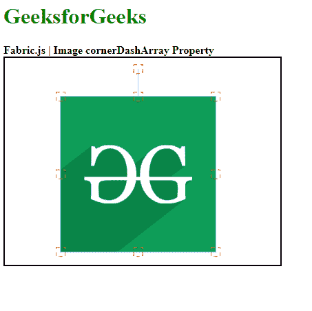

# Fabric.js Image cornerDashArray 属性

> 原文: [https://www.geeksforgeeks.org/fabric-js-image-cornerdasharray-property/](https://www.geeksforgeeks.org/fabric-js-image-cornerdasharray-property/)

`Fabric.js` 是一个用来处理画布的 JavaScript 库。`fabric.Image` 是用于创建图像实例的 `Fabric.js` 类之一。画布图像意味着图像是可移动的，可以根据需要拉伸。图像的 `cornerDashArray` 属性用于设置画布图像的控制角的虚线图案。

## 方法

首先导入 `fabric.js` 库。导入库后，在 `body` 标签中创建一个包含图像的画布块。之后，初始化一个由 `Fabric` 提供的 `Canvas` 和 `Image` 类的实例，并使用图像对象的 `cornerDashArray` 属性设置控制画布图像的角的虚线模式。

## 语法

```
fabric.Image(image, {
    cornerDashArray: [Number]
});
```

## 参数

该函数取两个参数，如上所述，描述如下:

*   `image`: 该参数取图像。
*   `cornerDashArray`: 此参数定义画布图像控制角点的虚线图案。

## 示例

本示例使用 `FabricJS` 将虚线图案设置为画布图像的控制角，如下例所示。

```
<!DOCTYPE html>
<html>

<head>
    <!-- Adding the FabricJS library -->
    <script src="https://cdnjs.cloudflare.com/ajax/libs/fabric.js/3.6.2/fabric.min.js">
    </script>
</head>

<body>
    <h1 style="color: green;">GeeksforGeeks</h1>
    <b>Fabric.js | Image cornerDashArray Property </b>

    <canvas id="canvas" width="400" height="300" style="border:2px solid #000000">
    </canvas>

    <br>

    <script>
        // Create the instance of canvas object
        var canvas = new fabric.Canvas("canvas");
        var img = document.getElementById('my-image');
        var imgInstance = new fabric.Image(img, {
            cornerColor: "red",
            cornerDashArray: [5]
        });
        canvas.add(imgInstance);
    </script>
</body>

</html>
```

## 输出

