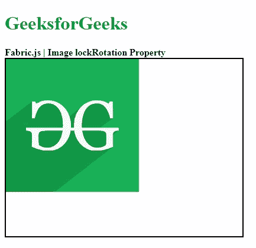

# Fabric.js 图像 lockRotation 属性

> 原文: [https://www.geeksforgeeks.org/fabric-js-image-lockrotation-property/](https://www.geeksforgeeks.org/fabric-js-image-lockrotation-property/)

Fabric.js 是一个用于处理画布的 JavaScript 库。`fabric.Image` 是用于创建图像实例的 Fabric.js 类之一。画布图像意味着图像是可移动的，可以根据需要拉伸。图像的 `lockRotation` 属性用于启用或禁用图像的旋转。

## 方法

首先导入 `fabric.js` 库。导入库后，在 `<body>` 标签中创建一个包含图像的画布块。之后，初始化一个由 Fabric.js 提供的 `Canvas` 和 `fabric.Image` 类的实例。然后使用 `lockRotation` 属性来启用或禁用画布图像的旋转。之后，在画布上渲染图像，并尝试旋转图像。

## 语法

```
fabric.Image(image, {
    lockRotation : Boolean
});
```

## 参数

该函数取两个参数，如上所述，描述如下：

*   `image`: 该参数取图像元素。
*   `lockRotation`: 此参数采用布尔值来启用或禁用画布图像的旋转。

## 示例

本示例使用 `FabricJS` 来启用或禁用画布图像的旋转，如下例所示。

## HTML示例

```
<!DOCTYPE html> 
<html>

<head> 
    <!-- Adding the FabricJS library -->
    <script src= 
"https://cdnjs.cloudflare.com/ajax/libs/fabric.js/3.6.2/fabric.min.js"> 
    </script> 
</head>

<body> 
    <h1 style="color: green;">
        GeeksforGeeks
    </h1> 
    <b> 
        Fabric.js | Image lockRotation Property  
    </b>

<canvas id="canvas" width="400" height="300"
        style="border:2px solid #000000"> 
    </canvas>


    <br>

<script>
        // Create the instance of canvas object
        var canvas = new fabric.Canvas("canvas");

        // Getting the image
        var img = document.getElementById('my-image');

        // Creating the image instance 
        var imgInstance = new fabric.Image(img, {
        });

        function lockRotation(){
            imgInstance = new fabric.Image(img, {
                lockRotation: true
            });
            canvas.clear();
            // Rendering the image to canvas
            canvas.add(imgInstance);
        }

        lockRotation();
    </script> 
</body>

</html>
```

## 输出

