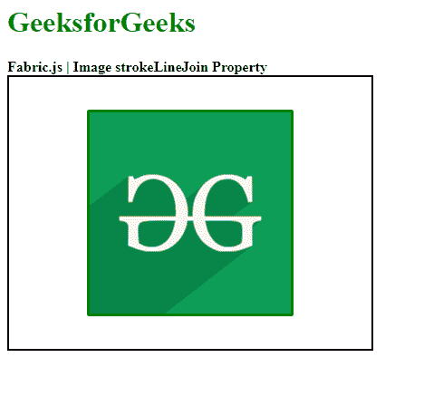

# Fabric.js Image strokeLineJoin 属性

> 原文: [https://www.geeksforgeeks.org/fabric-js-image-strokelinejoin-property/](https://www.geeksforgeeks.org/fabric-js-image-strokelinejoin-property/)

在本文中，我们将看到如何设置画布图像的 `strokeLineJoin`。画布图像是用于创建图像实例的 `fabric.js` 类之一。画布图像意味着图像是可移动的，可以根据需要拉伸。`strokeLineJoin` 属性用于设置画布图像中对象笔画的角样式。

## 方法

首先导入 `fabric.js` 库。导入库后，在 `body` 标签中创建一个包含图像的画布块。之后，初始化一个由 Fabric 提供的 `Canvas` 和 `image` 类的实例，并使用 `strokeLineJoin` 属性来设置画布图像的对象笔画的角样式。之后，在画布上渲染图像。

## 语法

```html
fabric.Image(image, {
    strokeLineJoin : string
});
```

## 参数

该功能取单个参数，如上所述，描述如下：

*   `strokeLineJoin`: 此参数采用一个字符串值来设置画布图像的对象笔画的角样式。这个参数的接受值是 `bevel`、`round` 和 `miter`。

## 示例

本示例使用 FabricJS 设置画布图像的 `strokeLineJoin` 属性，如下例所示:

## HTML

```html
<!DOCTYPE html>
<html>

<head>
    <!-- Adding the FabricJS library -->
    <script src="https://cdnjs.cloudflare.com/ajax/libs/fabric.js/3.6.2/fabric.min.js">
    </script>
</head>

<body>
    <h1 style="color: green;">
        GeeksforGeeks
    </h1>

    <b>
        Fabric.js | Image strokeLineJoin Property
    </b>

    <canvas id="canvas" width="400" height="300"
        style="border:2px solid #000000">
    </canvas>

    
    <br>

    <script>
        // Creating the instance of canvas object
        var canvas = new fabric.Canvas("canvas");

        // Getting the image
        var img = document.getElementById('my-image');

        // Creating the image instance
        var geeks = new fabric.Image(img, {
            stroke: 'green',
            strokeWidth: 3,
            strokeLineJoin: "bevel"
        });

        canvas.add(geeks);
        canvas.centerObject(geeks);
    </script>
</body>

</html>
```

## 输出

