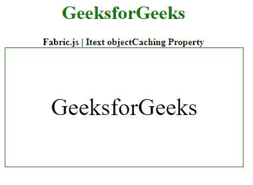

# Fabric.js IText objectCaching 属性

> 原文：`https://www.geeksforgeeks.org/fabric-js-itext-objectcaching-property/`

`Fabric.js` 是一个 `JavaScript` 库，用于处理画布。画布 `IText` 是用于创建 `IText` 实例的 `fabric.js` 类之一。画布 `IText` 是可移动的，可以根据需要拉伸。在本文中，我们将使用对象缓存属性。

## 方法

首先导入 `fabric.js` 库。导入库后，在 `body` 标签中创建一个包含 `IText` 的画布块。之后，初始化一个由 `Fabric` 提供的 `Canvas` 和 `IText` 类的实例，并使用 `objectCaching` 属性。

## 语法

```
fabric.IText(IText, {
      objectCaching : boolean
});
```

## 参数

该功能取单个参数，如上所述，描述如下：

*   `objectCaching`：该参数取布尔值。

## 示例

本示例使用 `FabricJS` 设置画布 `IText` 的 `objectCaching` 属性，如下例所示：

### HTML

```
<!DOCTYPE html> 
<html>

<head>
    <!-- FabricJS CDN -->
    <script src= 
"https://cdnjs.cloudflare.com/ajax/libs/fabric.js/3.6.2/fabric.min.js"> 
    </script> 
  </head>

<body> 
    <div style="text-align: center;width: 400px;"> 
      <h1 style="color: green;"> 
        GeeksforGeeks 
      </h1>
      <b> 
        Fabric.js IText objectCaching Property 
      </b> 
    </div>

<div style="text-align: center;"> 
      <canvas id="canvas" width="400" height="200"
              style="border:1px solid green;"> 
      </canvas> 
    </div>

<script> 
      // creating a new instance of canvas
      var canvas = new fabric.Canvas("canvas"); 
      // creating a new instance of IText
      var geek = new fabric.IText('GeeksforGeeks', {
        objectCaching : false
      });
      console.log(geek.willDrawShadow())
      // rendering IText object in canvas
      canvas.add(geek);
      canvas.centerObject(geek); 
    </script> 
  </body>

</html>
```

## 输出

