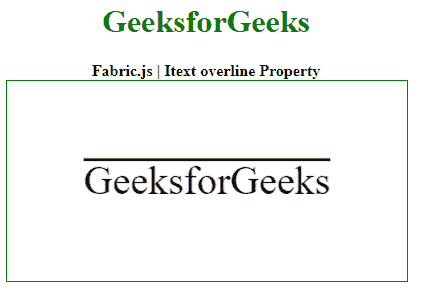

# Fabric.js IText overline 属性

> 原文: [https://www.geeksforgeeks.org/fabric-js-itext-overline-property/](https://www.geeksforgeeks.org/fabric-js-itext-overline-property/)

Fabric.js 是一个用于处理 HTML5 `canvas` 元素的 JavaScript 库。`canvas` 上的 `IText` 是用于创建 `IText` 实例的 `fabric.js` 类之一。`canvas` 上的 `IText` 是可移动的，并且可以根据需要进行缩放。在本文中，我们将使用 `overline` 属性。

**方法：** 首先导入 `fabric.js` 库。导入库后，在 `<body>` 标签中创建一个包含 `IText` 的 `canvas` 块。之后，初始化 `Fabric.js` 提供的 `Canvas` 和 `IText` 类的实例，并使用 `overline` 属性。

**语法：**

```html
fabric.IText('text', {
    overline: boolean
});
```

**参数：** 该函数采用如上所述的单个参数，描述如下：

*   `overline`：该参数取布尔值。

**示例：** 本示例使用 `FabricJS` 设置 `canvas` 上 `IText` 的 `overline` 属性，如下例所示：

## HTML

```html
<!DOCTYPE html>
<html>

<head>
    <!-- FabricJS CDN -->
    <script src="https://cdnjs.cloudflare.com/ajax/libs/fabric.js/3.6.2/fabric.min.js"></script>
</head>

<body>
    <div style="text-align: center; width: 400px;">
        <h1 style="color: green;">
            GeeksforGeeks
        </h1>
        <b>
            Fabric.js | IText overline Property
        </b>
    </div>

    <div style="text-align: center;">
        <canvas id="canvas" width="400" height="200" style="border:1px solid green;"></canvas>
    </div>

    <script>
        var canvas = new fabric.Canvas('canvas');

        var geek = new fabric.IText('GeeksforGeeks', {
            overline: true
        });

        console.log(geek.willDrawShadow());
        canvas.add(geek);
        canvas.centerObject(geek);
    </script>
</body>

</html>
```

**输出：**

