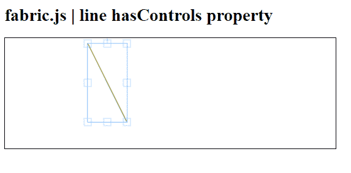
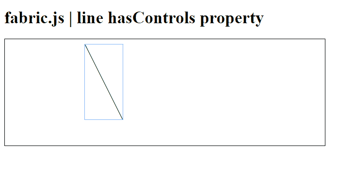

# Fabric.js 中 Line 对象的 hasControls 属性

> 原文: [https://www.geeksforgeeks.org/fabric-js-line-hascontrols-property/](https://www.geeksforgeeks.org/fabric-js-line-hascontrols-property/)

在本文中，我们将探讨在 **FabricJS** 中如何控制画布上 `Line` 对象的角点是否可见。画布中的线条是可移动的，并且可以根据需要进行拉伸。此外，线条在初始时可以通过自定义 `stroke` 颜色、高度、宽度、`fill` 颜色或 `strokeWidth` 来进行定制。

为了实现这一点，我们将使用一个名为 **FabricJS** 的 JavaScript 库。导入库之后，我们将在 `body` 标签中创建一个画布块，它将包含线条。之后，我们将初始化由 **FabricJS** 提供的 `Canvas` 和 `Line` 的实例。线条的角点是否可见，由 `Line` 对象的 `hasControls` 属性决定，并在画布上渲染线条，如下所示。

**语法:**

```html
fabric.line({
    hasControls : boolean
});
```

**参数:** 该属性接受一个参数，如上所述，如下所述。

*   `hasControls`: 指定是否能看到拐角。它包含一个布尔值。

**例 1:**

## HTML

```html
<!DOCTYPE html> 
<html>

<head>

<script src= 
"https://cdnjs.cloudflare.com/ajax/libs/fabric.js/3.6.2/fabric.min.js"> 
   </script> 
</head>

<body> 
   <h1>fabric.js | line hasControls  property</h1>
   <canvas id="canvas" width="600" height="200"
      style="border:1px solid #000000;"> 
   </canvas>

<script>

var canvas = new fabric.Canvas("canvas");

var line = new fabric.Line([150, 10, 220, 150], { 
         stroke: 'green',
         hasControls: true

});

canvas.add(line);

</script> 
</body>

</html> 
```

**输出:**



**例 2:**

## HTML

```html
<!DOCTYPE html> 
<html>

<head>

<script src= 
"https://cdnjs.cloudflare.com/ajax/libs/fabric.js/3.6.2/fabric.min.js"> 
   </script> 
</head>

<body> 
   <h1>fabric.js | line hasControls  property</h1>
   <canvas id="canvas" width="600" height="200"
      style="border:1px solid #000000;"> 
   </canvas>

<script>

var canvas = new fabric.Canvas("canvas");

var line = new fabric.Line([150, 10, 220, 150], { 
         stroke: 'green',
         hasControls: false

});

canvas.add(line);

</script> 
</body>

</html> 
```

**输出:**

