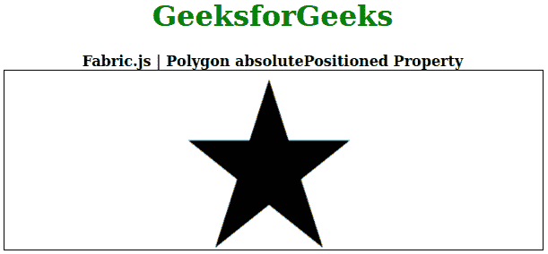

# Fabric.js 多边形 absolutePositioned 属性

> 原文：[https://www.geeksforgeeks.org/fabric-js-polygon-absolutepositioned-property/](https://www.geeksforgeeks.org/fabric-js-polygon-absolutepositioned-property/)

只有当对象用作剪辑路径时，它才有意义。画布多边形是指多边形是可移动的，可以根据需要拉伸。此外，当涉及到初始笔画颜色、形状、填充颜色或笔画宽度时，可以自定义多边形。

为了设置画布多边形的绝对位置，使用了名为 `FabricJS` 的 `JavaScript` 库。导入库之后，我们将在 `body` 标签中创建一个包含多边形的画布块。之后，我们将初始化由 `FabricJS` 提供的 `canvas` 和多边形的实例，并使用 `absolutePositioned` 属性设置 `Canvas` 多边形的绝对位置。

## 语法

```
fabric.Polygon([
   { x: pixel, y: pixel },
   { x: pixel, y: pixel },
   { x: pixel, y: pixel},
   { x: pixel, y: pixel},
   { x: pixel, y: pixel }],
   { absolutePositioned: boolean }
);
```

## 参数

该函数接受如上所述的单个参数，如下所述：

*   `absolutePositioned`：保存布尔值。

## 示例

下面的例子说明了 `Fabric.js` 中的多边形 `absolutePositioned` 属性：

### 示例 1

这里，`absolutePositioned` 属性设置为 `false`。

```
<!DOCTYPE html> 
<html>

<head> 
    <!-- Loading the FabricJS library -->
    <script src= 
"https://cdnjs.cloudflare.com/ajax/libs/fabric.js/3.6.2/fabric.min.js"> 
    </script> 
</head>

<body> 
    <div style="text-align: center;width: 600px;"> 
        <h1 style="color: green;"> 
            GeeksforGeeks 
        </h1> 
        <b> 
            Fabric.js | Polygon absolutePositioned Property 
        </b> 
    </div>

<canvas id="canvas"
            width="600"
            height="200"
            style="border:1px solid #000000;"> 
    </canvas>

<script>
        // Initiate a Canvas instance 
        var canvas = new fabric.Canvas("canvas");

        // Initiate a polygon instance 
        var polygon = new fabric.Polygon([ 
        { x: 295, y: 10 }, 
        { x: 235, y: 198 }, 
        { x: 385, y: 78}, 
        { x: 205, y: 78}, 
        { x: 355, y: 198 }], { 
            absolutePositioned: false
        });

        // Render the polygon in canvas 
        canvas.add(polygon); 
    </script> 
</body>

</html>
```

**输出：**



### 示例 2

这里，`absolutePositioned` 属性设置为 `true`。

```
<!DOCTYPE html> 
<html>

<head> 
    <!-- Loading the FabricJS library -->
    <script src= 
"https://cdnjs.cloudflare.com/ajax/libs/fabric.js/3.6.2/fabric.min.js"> 
    </script> 
</head>

<body> 
    <div style="text-align: center;width: 600px;"> 
        <h1 style="color: green;"> 
            GeeksforGeeks 
        </h1> 
        <b> 
            Fabric.js | Polygon absolutePositioned Property 
        </b> 
    </div>

<canvas id="canvas"
            width="600"
            height="200"
            style="border:1px solid #000000;"> 
    </canvas>

<script>
        // Initiate a Canvas instance 
        var canvas = new fabric.Canvas("canvas");

        // Initiate a polygon instance 
        var polygon = new fabric.Polygon([ 
        { x: 295, y: 10 }, 
        { x: 235, y: 198 }, 
        { x: 385, y: 78}, 
        { x: 205, y: 78}, 
        { x: 355, y: 198 }], { 
            absolutePositioned: true
        });

        // Render the polygon in canvas 
        canvas.add(polygon); 
    </script> 
</body>

</html>
```

**输出：**


## 参考

[http://fabricjs.com/docs/fabric.Polygon.html#absolutePositioned](http://fabricjs.com/docs/fabric.Polygon.html#absolutePositioned)