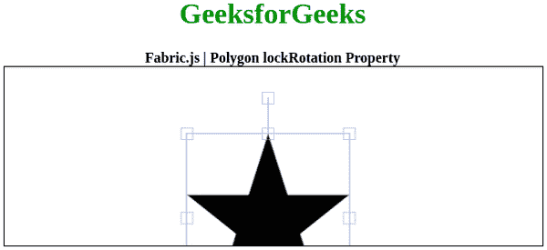
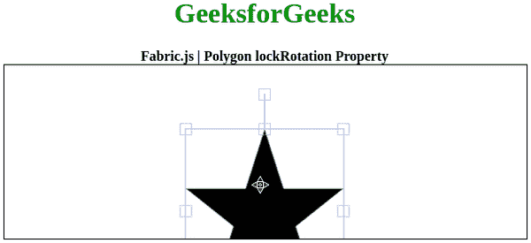

# Fabric.js 多边形锁定旋转属性

> 原文: [https://www.geeksforgeeks.org/fabric-js-polygon-lockrotation-property/](https://www.geeksforgeeks.org/fabric-js-polygon-lockrotation-property/)

在本文中，我们将看到如何使用 `FabricJS` 锁定画布多边形的旋转。画布多边形是指多边形是可移动的，可以根据需要拉伸。此外，当涉及到初始笔画颜色、形状、填充颜色或笔画宽度时，可以自定义多边形。

为了实现这一点，我们将使用一个名为 `FabricJS` 的 JavaScript 库。导入库之后，我们将在主体标签中创建一个包含多边形的画布块。之后，我们将初始化由 `fabric` 提供的画布和多边形的实例，并使用 `lockRotation` 属性锁定画布多边形的旋转，并在画布上渲染多边形，如下例所示。

## 语法

```
fabric.Polygon([
    { x: pixel, y: pixel },
    { x: pixel, y: pixel },
    { x: pixel, y: pixel },
    { x: pixel, y: pixel },
    { x: pixel, y: pixel }],
    {
        lockRotation: boolean
    }
);
```

## 参数

该属性接受如上所述的单个参数，如下所述:

*   `lockRotation`: 指定是否启用旋转。

## 注意

创建多边形必须要有尺寸像素。

以下示例说明了在 JavaScript 中的 `Fabric.js` 多边形 `lockRotation` 属性:

### 示例 1

此处 `lockRotation` 处于启用状态。

#### HTML

```
<!DOCTYPE html>
<html>

<head>
    <!-- Loading the FabricJS library -->
    <script src="https://cdnjs.cloudflare.com/ajax/libs/fabric.js/3.6.2/fabric.min.js">
    </script>
</head>

<body>
    <div style="text-align: center;width: 600px;">
        <h1 style="color: green;">
            GeeksforGeeks
        </h1>
        <b>
            Fabric.js | Polygon lockRotation Property
        </b>
    </div>

<canvas id="canvas"
            width="600"
            height="200"
            style="border:1px solid #000000;">
    </canvas>

<script>
        // Initiate a Canvas instance
        var canvas = new fabric.Canvas("canvas");

        // Initiate a polygon instance
        var polygon = new fabric.Polygon([
        { x: 295, y: 10 },
        { x: 235, y: 198 },
        { x: 385, y: 78},
        { x: 205, y: 78},
        { x: 355, y: 198 }], {
            lockRotation: true
        });

        // Render the polygon in canvas
        canvas.add(polygon);
    </script>
</body>

</html>
```

**输出:** 

### 示例 2

此处 `lockRotation` 被禁用。

#### HTML

```
<!DOCTYPE html>
<html>

<head>
    <!-- Loading the FabricJS library -->
    <script src="https://cdnjs.cloudflare.com/ajax/libs/fabric.js/3.6.2/fabric.min.js">
    </script>
</head>

<body>
    <div style="text-align: center;width: 600px;">
        <h1 style="color: green;">
            GeeksforGeeks
        </h1>
        <b>
            Fabric.js | Polygon lockRotation Property
        </b>
    </div>

<canvas id="canvas"
            width="600"
            height="200"
            style="border:1px solid #000000;">
    </canvas>

<script>
        // Initiate a Canvas instance
        var canvas = new fabric.Canvas("canvas");

        // Initiate a polygon instance
        var polygon = new fabric.Polygon([
        { x: 295, y: 10 },
        { x: 235, y: 198 },
        { x: 385, y: 78},
        { x: 205, y: 78},
        { x: 355, y: 198 }], {
            lockRotation: false
        });

        // Render the polygon in canvas
        canvas.add(polygon);
    </script>
</body>

</html>
```

**输出:** 