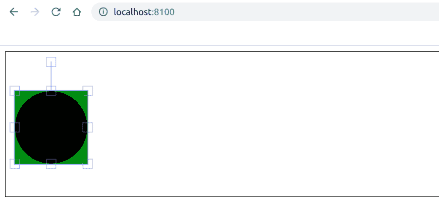

# How to Change Selection Background Color of a Canvas Circle Using Fabric.js?

> 原文: [https://www.geeksforgeeks.org/how-to-change-selection-background-color-of-a-canvas-circle-using-fabric-js/](https://www.geeksforgeeks.org/how-to-change-selection-background-color-of-a-canvas-circle-using-fabric-js/)

In this article, we will see how to change the selection background color of a canvas circle using FabricJS. Canvas means the circle is movable and can be stretched according to requirement. Further, the initial stroke color, fill color, stroke width, or radius can be customized.

## Method

To make this possible, we will use a JavaScript library called FabricJS. After importing the library using CDN, we will create a `canvas` block containing our circle in the body tag. After that, we will initialize the `Canvas` and `Circle` instances provided by FabricJS and use the `selectionBackgroundColor` property to change the selection background color of the circle and render the circle on the Canvas, as shown in the example below.

## Syntax

```javascript
fabric.Circle({
    radius: number,
    selectionBackgroundColor: string
});
```

## Parameters

This function accepts two parameters as mentioned above, which are as follows:

*   `radius`: Specifies the radius.
*   `selectionBackgroundColor`: Specifies the color of the selection background.

## Example

This example uses FabricJS to change the selection background color of a canvas circle. Note that you must click on the object to see its selection background color.

```html
<!DOCTYPE html>
<html>

<head>
    <title>
        How to change selection background color
        of a canvas circle using FabricJS?
    </title>

    <!-- FabricJS CDN -->
    <script src="https://cdnjs.cloudflare.com/ajax/libs/fabric.js/3.6.2/fabric.min.js">
    </script>
</head>

<body>
    <canvas id="canvas" width="600" height="200"
        style="border:1px solid #000000">
    </canvas>

    <script>
        // Initiate a Canvas instance
        var canvas = new fabric.Canvas("canvas");

        // Initiate a Circle instance
        var circle = new fabric.Circle({
            radius: 50,
            selectionBackgroundColor: 'green'
        });

        // Render the circle in canvas
        canvas.add(circle);
    </script>
</body>

</html>
```

## Output

