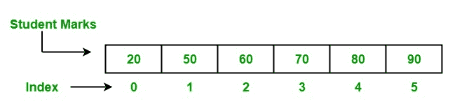
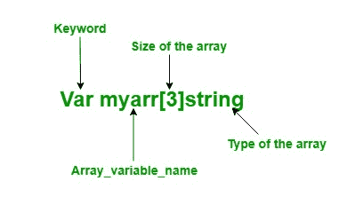
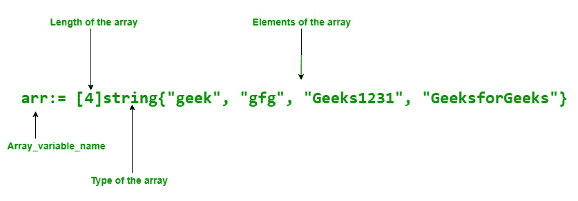

# Go 中的数组

> 原文:[https://www.geeksforgeeks.org/arrays-in-go/](https://www.geeksforgeeks.org/arrays-in-go/)

Golang 或 [Go 编程语言](https://www.geeksforgeeks.org/go-programming-language-introduction/)中的数组与其他编程语言非常相似。在程序中，有时我们需要存储一组相同类型的数据，比如学生成绩列表。这种类型的集合存储在使用数组的程序中。数组是固定长度的序列，用于在内存中存储同类元素。由于它们的固定长度数组不太受欢迎，像围棋语言中的切片。

在数组中，可以存储零个或零个以上的元素。数组的元素通过使用`[]`索引操作符以其从零开始的位置进行索引，这意味着第一个元素的索引是`array[0]`，最后一个元素的索引是`array[len(array)-1]`。



## 创建和访问阵列

在 Go 语言中，数组以两种不同的方式创建:

### 1. 使用 `var` 关键字

在 Go 语言中，数组使用 `var` 关键字创建，指定类型、名称、大小和元素。

**语法:**

```go
var array_name[length]Type
or
var array_name[length]Type{item1, item2, item3, ...itemN}
```

**要点:**

*   在 Go 语言中，数组是可变的，因此您可以使用 `array[index]` 语法在赋值语句的左侧设置给定索引处的数组元素。

```go
var array_name[index] = element
```



*   您可以使用索引值或 `for` 循环来访问数组的元素。
*   在 Go 语言中，数组类型是一维的。
*   数组的长度是固定不变的。
*   您被允许在数组中存储重复的元素。

**示例:**

```go
// Go program to illustrate how to
// create an array using the var keyword
// and accessing the elements of the
// array using their index value
package main

import "fmt"

func main() {

	// Creating an array of string type
	// Using var keyword
	var myarr[3]string

	// Elements are assigned using index
	myarr[0] = "GFG"
	myarr[1] = "GeeksforGeeks"
	myarr[2] = "Geek"

	// Accessing the elements of the array
	// Using index value
	fmt.Println("Elements of Array:")
	fmt.Println("Element 1: ", myarr[0])
	fmt.Println("Element 2: ", myarr[1])
	fmt.Println("Element 3: ", myarr[2])
}
```

**输出:**

```go
Elements of Array:
Element 1:  GFG
Element 2:  GeeksforGeeks
Element 3:  Geek
```

### 2. 使用简短声明

在 Go 语言中，数组也可以使用简短声明来声明。它比上面的声明更灵活。

**语法:**

```go
array_name:= [length]Type{item1, item2, item3,...itemN}
```



**示例:**

```go
// Go program to illustrate how to create
// an array using shorthand declaration
// and accessing the elements of the
// array using for loop
package main

import "fmt"

func main() {

	// Shorthand declaration of array
	arr:= [4]string{"geek", "gfg", "Geeks1231", "GeeksforGeeks"}

	// Accessing the elements of
	// the array Using for loop
	fmt.Println("Elements of the array:")

	for i:= 0; i < 3; i++{
		fmt.Println(arr[i])
	}
}
```

**输出:**

```go
Elements of the array:
geek
gfg
Geeks1231
```

## 多维数组

我们已经知道数组是一维的，但是你可以创建多维数组。多维数组是同类型数组的**数组**。在 Go 语言中，可以使用以下语法创建多维数组:

```go
Array_name[Length1][Length2]..[LengthN]Type
```

您可以使用 `var` 关键字或使用速记声明创建多维数组，如下例所示。

**注意:**在多维数组中，如果一个单元格没有被用户用某个值初始化，那么编译器会自动用零初始化。Golang 中没有未初始化的概念。

**示例:**

```go
// Go program to illustrate the
// concept of multi-dimension array
package main

import "fmt"

func main() {

	// Creating and initializing
	// 2-dimensional array
	// Using shorthand declaration
	// Here the (,) Comma is necessary
	arr:= [3][3]string{{"C#", "C", "Python"},
		{"Java", "Scala", "Perl"},
		{"C++", "Go", "HTML"},}

	// Accessing the values of the
	// array Using for loop
	fmt.Println("Elements of Array 1")
	for x:= 0; x < 3; x++{
		for y:= 0; y < 3; y++{
			fmt.Println(arr[x][y])
		}
	}

	// Creating a 2-dimensional
	// array using var keyword
	// and initializing a multi
	// -dimensional array using index
	var arr1 [2][2] int
	arr1[0][0] = 100
	arr1[0][1] = 200
	arr1[1][0] = 300
	arr1[1][1] = 400

	// Accessing the values of the array
	fmt.Println("Elements of array 2")
	for p:= 0; p<2; p++{
		for q:= 0; q<2; q++{
			fmt.Println(arr1[p][q])
		}
	}
}
```

**输出:**

```go
Elements of Array 1
C#
C
Python
Java
Scala
Perl
C++
Go
HTML
Elements of array 2
100
200
300
400
```

## 关于数组的重要观察

1.  在数组中，如果数组没有显式初始化，那么**该数组的默认值是 0**。

**示例:**

```go
// Go program to illustrate an array
package main

import "fmt"

func main() {

	// Creating an array of int type
	// which stores, two elements
	// Here, we do not initialize the
	// array so the value of the array
	// is zero
	var myarr[2]int
	fmt.Println("Elements of the Array :", myarr)
}
```

**输出:**

```go
Elements of the Array : [0 0]
```

2.  在数组中，您可以使用 `len()` 方法来查找数组的长度，如下所示：

**示例:**

```go
// Go program to illustrate how to find
// the length of the array
package main

import "fmt"

func main() {

	// Creating array
	// Using shorthand declaration
	arr1:= [3]int{9,7,6}
	arr2:= [...]int{9,7,6,4,5,3,2,4}
	arr3:= [3]int{9,3,5}

	// Finding the length of the
	// array using len method
	fmt.Println("Length of the array 1 is:", len(arr1))
	fmt.Println("Length of the array 2 is:", len(arr2))
	fmt.Println("Length of the array 3 is:", len(arr3))
}
```

**输出:**

```go
Length of the array 1 is: 3
Length of the array 2 is: 8
Length of the array 3 is: 3
```

3.  在数组中，如果省略号 `…` 出现在长度的位置，那么数组的长度由初始化的元素数量决定。如下例所示：

**示例:**

```go
// Go program to illustrate the
// concept of ellipsis in an array
package main

import "fmt"

func main() {

	// Creating an array whose size is determined
	// by the number of elements present in it
	// Using ellipsis
	myarray:= [...]string{"GFG", "gfg", "geeks",
		"GeeksforGeeks", "GEEK"}

	fmt.Println("Elements of the array: ", myarray)

	// Length of the array
	// is determine by
	// Using len() method
	fmt.Println("Length of the array is:", len(myarray))
}
```

**输出:**

```go
Elements of the array:  [GFG gfg geeks GeeksforGeeks GEEK]
Length of the array is: 5
```

4.  在数组中，您可以迭代数组元素的范围。如下例所示：

**示例:**

```go
// Go program to illustrate
// how to iterate the array
package main

import "fmt"

func main() {

	// Creating an array whose size
	// is represented by the ellipsis
	myarray:= [...]int{29, 79, 49, 39,
		20, 49, 48, 49}

	// Iterate array using for loop
	for x:=0; x < len(myarray); x++{
		fmt.Printf("%d\n", myarray[x])
	}
}
```

**输出:**

```go
29
79
49
39
20
49
48
49
```

5.  在 Go 语言中，**数组是值类型而不是引用类型**。因此，当数组被赋值给一个新变量时，在新变量中所做的更改不会影响原始数组。如下例所示：

**示例:**

```go
// Go program to illustrate value type array
package main

import "fmt"

func main() {

	// Creating an array whose size
	// is represented by the ellipsis
	my_array:= [...]int{100, 200, 300, 400, 500}
	fmt.Println("Original array(Before):", my_array)

	// Creating a new variable
	// and initialize with my_array
	new_array := my_array

	fmt.Println("New array(before):", new_array)

	// Change the value at index 0 to 500
	new_array[0] = 500

	fmt.Println("New array(After):", new_array)

	fmt.Println("Original array(After):", my_array)
}
```

**输出:**

```go
Original array(Before): [100 200 300 400 500]
New array(before): [100 200 300 400 500]
New array(After): [500 200 300 400 500]
Original array(After): [100 200 300 400 500]
```

## 6. In an array, if the element type of the array is comparable, then the array type is also comparable.

So `we can directly compare two arrays using == operator`. As shown in the below example:

### 示例:

```go
    // Go program to illustrate 
    // how to compare two arrays
    package main

import "fmt"

func main() {

// Arrays    
    arr1:= [3]int{9,7,6}
    arr2:= [...]int{9,7,6}
    arr3:= [3]int{9,5,3}

// Comparing arrays using == operator
    fmt.Println(arr1==arr2)
    fmt.Println(arr2==arr3)
    fmt.Println(arr1==arr3)

// This will give and error because the 
    // type of arr1 and arr4 is a mismatch 
    /*
    arr4:= [4]int{9,7,6}
    fmt.Println(arr1==arr4)
    */
    }
    ```

### 输出:

```go
    true
    false
    false

```