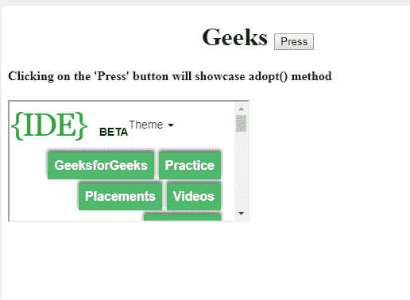
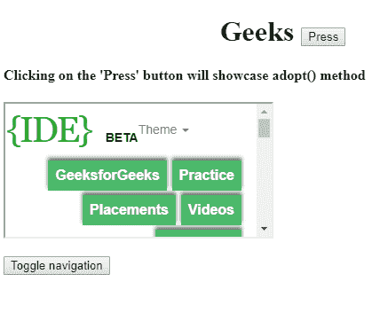

# HTML DOM adoptNode()方法

> 原文：[https://www.geeksforgeeks.org/html-dom-adoptnode-method/](https://www.geeksforgeeks.org/html-dom-adoptnode-method/)

## 概述

`adoptNode()`方法用于从另一个文档中收养一个节点。它可以用于所有节点类型。该方法会收养所有子节点以及原始节点本身。`adoptNode()`方法返回被收养的节点对象。

## 语法

```html
document.adoptNode(node)
```

## 参数

`adoptNode()`方法只包含一个参数：

*   `node`：需要被收养的任意类型的节点。

## 返回值

返回一个节点对象，代表被收养的节点。

## 示例

```html
<!DOCTYPE html>
<html>

<body>
    <h1><center>Geeks
<button onclick="adopt()">Press</button>
</center> </h1>

<h4>Clicking on the 'Press' button
will showcase adopt() method</h4>

<p id="gfg">

<iframe
    src="https://ide.geeksforgeeks.org/tryit.php">
        </iframe>

</p>

<script>
        function adopt() {
            var frame =
              document.getElementsByTagName(
                "iframe")[0];

var h =
    frame.contentWindow.document.getElementsByTagName(
                "button")[0];

// 'h' is button type adopted node.
            var x = document.adoptNode(h);
            document.body.appendChild(x);
        }
    </script>

</body>

</html>
```

## 输出

按下按钮前：



按下按钮后：



**注意：** 该方法会收养所有子节点。

## 浏览器支持

下面列出了支持`adoptNode()`方法的浏览器：

*   谷歌 Chrome
*   微软 Edge
*   火狐浏览器
*   Opera
*   Safari