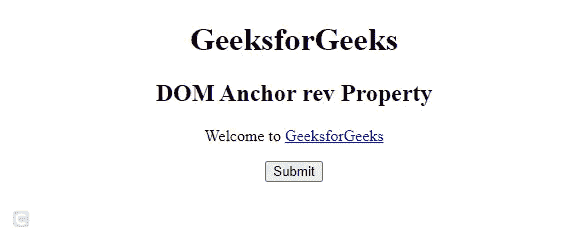
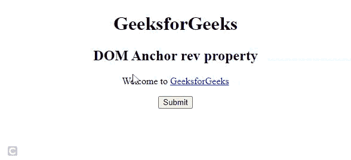

# HTML DOM 锚点 `rev` 属性

> 原文：[https://www.geeksforgeeks.org/html-dom-anchor-rev-property/](https://www.geeksforgeeks.org/html-dom-anchor-rev-property/)

HTML DOM Anchor `rev` 属性用于设置或返回 `<a>` 元素中 `rev` 属性的值。`rev` 属性用于指定链接文档和当前文档之间的关系。

## 语法

- 它返回锚 `rev` 属性。
```html
anchorObject.rev
```
- 用于设置锚 `rev` 属性。
```html
anchorObject.rev = "value"
```

## 属性值

- `alternate`：它定义了文档的替代版本，即打印页面、翻译或镜像。
- `stylesheet`：它为文档定义一个外部表。
- `start`：它定义一个选择中的第一个文档。
- `next`：定义选择中的下一个文档。
- `prev`：定义选择中的上一个文档。
- `contents`：定义文档的目录。
- `index`：定义文档的索引。
- `glossary`：它定义了文档中使用的单词的解释。
- `copyright`：定义包含一条版权信息的文档。
- `chapter`：指定文档的章节。
- `section`：定义文档的一个节。
- `subsection`：指定文件的一个子节。
- `appendix`：规定了文件的附录。
- `help`：指定帮助文档。
- `bookmark`：指定相关文档。
- `nofollow`：它被谷歌使用，用来指定谷歌搜索蜘蛛不应该跟随那个链接，并且主要用于付费链接。
- `license`：定义文档的版权信息。
- `tag`：指定当前文档的标签关键字。

## 示例 1

下面的代码说明了如何返回锚 `rev` 属性。

### HTML

```html
<!DOCTYPE html>
<html>

<body>
    <center>
        <h1>GeeksforGeeks</h1>
        <h2>DOM Anchor rev Property</h2>
        <p>Welcome to
            <a href="https://www.geeksforgeeks.org" id="linkID"
                rev="nofollow" target="_self">
                GeeksforGeeks
            </a>
        </p>
        <button onclick="btnClick()">Submit</button>
        <p id="paraID" style="color:green;font-size:25px;"></p>
        <!-- Script to return Anchor rel property -->
        <script>
            function btnClick() {
                var x = document.getElementById("linkID").rev;
                document.getElementById("paraID").innerHTML = x;
            }
        </script>
    </center>
</body>

</html>
```

### 输出



## 示例 2

下面的 HTML 代码说明了如何设置锚点 `rev` 属性。

### HTML

```html
<!DOCTYPE html>
<html>

<head>
    <title>
        HTML DOM Anchor rev Property
    </title>
</head>

<body>
    <center>
        <h1>GeeksforGeeks</h1>
        <h2>DOM Anchor rev property</h2>
        <p>Welcome to
            <a href="https://www.geeksforgeeks.org" id="linkID"
                rev="nofollow" target="_self">
                GeeksforGeeks
            </a>
        </p>
        <button onclick="btnclick()">Submit</button>
        <p id="paraID" style="color:green;font-size:20px;"></p>
        <!-- Script to set Anchor rel property -->
        <script>
            function btnclick() {
                var x = document.getElementById(
                    "linkID").rel = "chapter";
                document.getElementById("paraID")
                    .innerHTML = "The value of the rev "
                    + "attribute was changed to " + x;
            }
        </script>
    </center>
</body>

</html>
```

### 输出



## 支持的浏览器

- 谷歌 Chrome
- 微软公司出品的 web 浏览器
- 歌剧
- 火狐浏览器
- 苹果 Safari