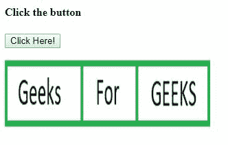

# HTML DOM 区域对象

> 原文：[https://www.geeksforgeeks.org/html-dom-area-object/](https://www.geeksforgeeks.org/html-dom-area-object/)

HTML DOM 中的**区域对象**属性用于创建和访问对象中的 `<area>` 元素。例如，使图像区域可点击，并通过可在地图或其他对象中进一步使用的区域访问其他数据。

## 语法

*   它用于访问元素。

```html
var x = document.getElementById("myArea");
```

*   用于创建元素。

```html
var x = document.createElement("AREA");
```

## 属性值

| 属性 | 描述 |
| :--- | :--- |
| `alt` | 它用于设置或返回区域的 `alt` 属性值。 |
| `coords` | 它用于设置或返回一个区域的 `coords` 属性值。 |
| `hash` | 它用于设置或返回 `href` 属性值的锚点部分。 |
| `host` | 它用于设置或返回 `href` 属性值的主机名和端口部分。 |
| `hostname` | 它用于设置或返回 `href` 属性值的主机名部分。 |
| `href` | 它用于设置或返回区域的 `href` 属性值。 |
| `noHref` | 它用于设置或返回区域的 `nohref` 属性的值。 |
| `origin` | 它用于返回 `href` 属性值的协议、主机名和端口部分。 |
| `password` | 它用于设置或返回 `href` 属性值的密码部分。 |
| `pathname` | 它用于设置或返回 `href` 属性值的路径名部分。 |
| `port` | 它用于设置或返回 `href` 属性值的端口部分。 |
| `protocol` | 它用于设置或返回 `href` 属性值的协议部分。 |
| `search` | 它用于设置或返回 `href` 属性值的 querystring 部分。 |
| `shape` | 它用于设置或返回区域的 `shape` 属性值。 |
| `target` | 它用于设置或返回一个区域的 `target` 属性值。 |
| `username` | 它用于设置或返回 `href` 属性值的用户名部分。 |

## 示例-1：返回可点击图像的 href 属性

```html
<!DOCTYPE html>
<html>
<title>
    HTML DOM Area Object Property
</title>

<body>
    <h4>Click the button</h4>
    <button onclick="GFG()">Click Here!
        <br>
    </button>
    <map name="Geeks1">
        <area id="Geeks"
              shape="rect"
              coords="0, 0, 110, 100"
              alt="Geeks"
              href="https://media.geeksforgeeks.org/wp-content/uploads/a1-21.png">
    </map>

    

    <p id="GEEK!"></p>

    <script>
        function GFG() {
            // Return href attribute.
            var x = document.getElementById("Geeks").href;
            document.getElementById("GEEK!").innerHTML = x;
        }
    </script>
</body>
</html>
```

**输出：**


## 示例-2：创建区域元素并设置 href 属性

```html
<!DOCTYPE html>
<html>
<title>
    HTML DOM Area Object Property
</title>

<body>
    <h4>Click the button</h4>
    <button onclick="GFG()">Click Here!
        <br>
    </button>
    <p></p>
    

    <map id="myMap" name="planetmap">
    </map>

    <p id="GEEK!"></p>

    <script>
        function GFG() {
            // creating area element using document.createElement("AREA");
            var y = document.createElement("AREA");
            y.setAttribute("href", "https://media.geeksforgeeks.org/wp-content/uploads/a1-24.png");
            y.setAttribute("shape", "rect");
            y.setAttribute("coords", "190, 0, 300, 100");
            document.getElementById("myMap").appendChild(y);
            document.getElementById("GEEK!").innerHTML = "Click on the GEEKS area in the image.";
        }
    </script>
</body>
</html>
```

**输出：**


## 执行上述代码的步骤

*   保存文件。
*   在标准浏览器上执行。

## 支持的浏览器

**DOM 区域对象属性**支持的浏览器如下：

*   谷歌 Chrome 5.0
*   Internet Explorer 8.0
*   Firefox 3.6
*   Safari 5.0
*   Opera 10.6