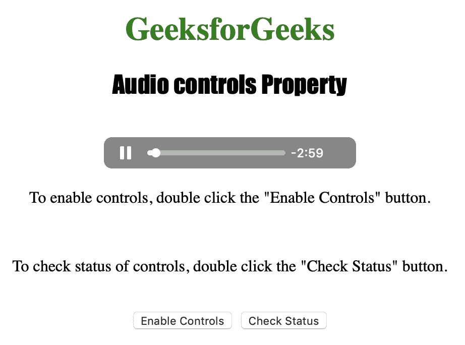
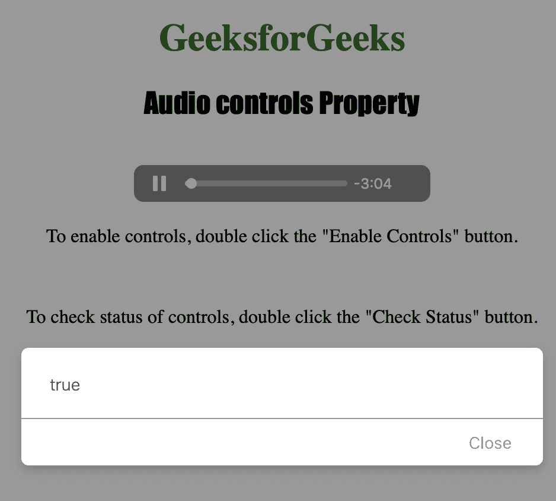

# HTML DOM 音频控件属性

> 原文: [https://www.geeksforgeeks.org/html-dom-audio-controls-property/](https://www.geeksforgeeks.org/html-dom-audio-controls-property/)

音频控件属性用于设置或返回音频是否显示标准音频控件。该属性反映了 `<audio>` 控件属性。
属性中包含的音频控件有:

1.  播放
2.  暂停
3.  寻找
4.  音量

## 语法

*   返回控件属性:
    `audioObject.controls`

*   设置控制属性:
    `audioObject.controls = true|false`

## 属性值

`true|false`: 用于指定音频是否应显示控件。

## 返回值

如果显示音频控件，则返回布尔值 `true`，否则返回 `false`。

下面的程序说明了音频控件属性:

## 示例

启用音频控件。

```html
<!DOCTYPE html>
<html>

<head>
    <title>
        Audio controls Property
    </title>
</head>

<body style="text-align: center">

<h1 style="color: green">
      GeeksforGeeks
    </h1>
    <h2 style="font-family: Impact">
      Audio controls Property
    </h2>
    <br>

<audio id="Test_Audio" 
           controls autoplay>

<source src="sample1.ogg"
                type="audio/ogg">

<source src="sample1.mp3" 
                type="audio/mpeg">
    </audio>

<p>To enable controls, double click
      the "Enable Controls" button.</p>
    <br>

<p>To check status of controls, double
      click the "Check Status" button.</p>
    <br>

<button ondblclick="Enable_Audio()">
      Enable Controls
    </button>
    <button ondblclick="Check_Audio()">
      Check Status
    </button>

<p id="test"></p>

<script>
        var a = document.getElementById("Test_Audio");

function Enable_Audio() {
            a.controls = true;
            a.load();
        }

function Check_Audio() {
            alert(a.controls);
        }
    </script>

</body>

</html>
```

## 输出

*   点击按钮前:
    
*   点击按钮后:
    

## 支持的浏览器

以下列出了 HTML DOM 音频控件属性支持的浏览器:

*   谷歌 Chrome
*   微软 Edge
*   火狐浏览器
*   Opera
*   苹果 Safari