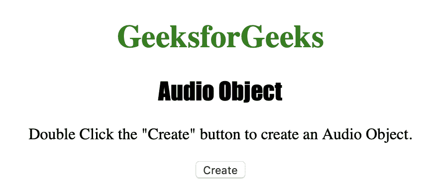
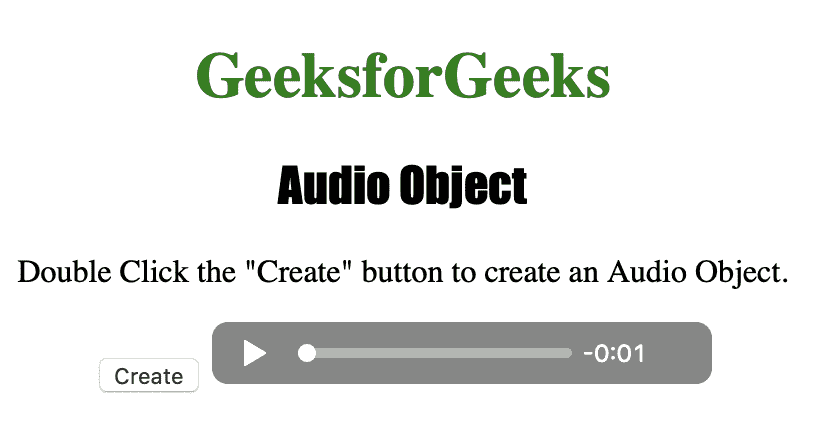
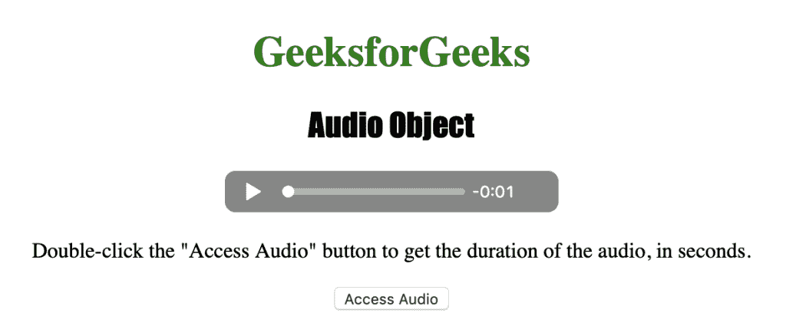
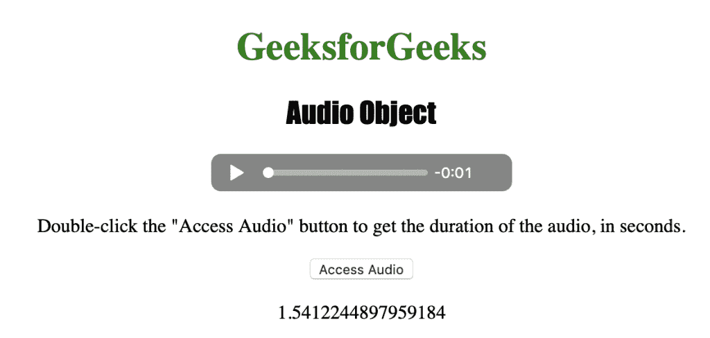

# HTML | DOM 音频对象

> 原文: [https://www.geeksforgeeks.org/html-dom-audio-object/](https://www.geeksforgeeks.org/html-dom-audio-object/)

**音频对象**用于表示 HTML `<audio>` 元素。
音频对象是 **HTML5** 中的新对象。

## 语法

*   用于创建 `<audio>` 元素:

```html
var gfg = document.createElement("AUDIO")
```

*   用于访问 `<audio>` 元素:

```html
var x = document.getElementById("myAudio")
```

## 属性值

| 属性 | 描述 |
| :--- | :--- |
| `audioTracks` | 它用于返回代表可用音频轨道的 `AudioTrackList` 对象。 |
| `autoplay` | 它用于设置或返回音频是否应在准备就绪后立即开始播放。 |
| `buffered` | 它用于返回代表音频缓冲部分的 `TimeRanges` 对象。 |
| `controller` | 它用于返回表示音频的当前媒体控制器的 `MediaController` 对象。 |
| `controls` | 它用于设置或返回音频是否应该显示控制(播放/暂停等)。 |
| `crossOrigin` | 它用于设置或返回音频的 CORS 设置。 |
| `currentSrc` | 用于返回当前音频的网址。 |
| `currentTime` | 它用于设置或返回音频中的当前播放位置(以秒为单位)。 |
| `defaultMuted` | 它用于设置或返回音频是否默认静音。 |
| `defaultPlaybackRate` | 它用于设置或返回音频的默认播放速度。 |
| `duration` | 它用于返回音频的长度(秒)。 |
| `ended` | 用于返回音频播放是否结束。 |
| `error` | 它用于返回表示音频错误状态的 `MediaError` 对象。 |
| `loop` | 它用于设置或返回音频是否应该在每次结束时重新开始播放。 |
| `mediaGroup` | 它用于设置或返回音频所属媒体组的名称。 |
| `muted` | 它用于设置或返回是否应该关闭声音。 |
| `networkState` | 它用于返回音频的当前网络状态。 |
| `paused` | 它用于设置或返回音频是否暂停。 |
| `playbackRate` | 它用于设置或返回音频播放速度。 |
| `played` | 它用于返回代表音频播放部分的 `TimeRanges` 对象。 |
| `preload` | 它用于设置或返回音频的预加载属性值。 |
| `readyState` | 它用于设置或返回音频的当前就绪状态。 |
| `seekable` | 它用于返回代表音频中可查找部分的 `TimeRanges` 对象。 |
| `seeking` | 它用于返回用户当前是否在音频中寻找。 |
| `src` | 它用于设置或返回音频的 `src` 属性值。 |
| `textTracks` | 它用于返回表示可用文本轨道的 `TextTrackList` 对象。 |
| `volume` | 它用于设置或返回音频的音量。 |

## 音频对象方法

| 方法 | 描述 |
| :--- | :--- |
| `addTextTrack()` | 它用于向音频添加新的文本轨道。 |
| `canPlayType()` | 用于检查浏览器是否可以播放指定的音频类型。 |
| `fastSeek()` | 它用于在音频播放器中查找到指定的时间。 |
| `getStartDate()` | 它用于返回一个新的日期对象，表示当前的时间线偏移。 |
| `load()` | 它用于重新加载音频元素。 |
| `play()` | 它用于开始播放音频。 |
| `pause()` | 它用于暂停当前播放的音频。 |

下面的程序说明了音频对象:

## 示例-1: 创建一个 `<audio>` 元素

```html
<!DOCTYPE html>
<html>

<head>
    <title>Audio Object</title>
    <style>
        h1 {
            color: green;
        }

        h2 {
            font-family: Impact;
        }

        body {
            text-align: center;
        }
    </style>
</head>

<body>

    <h1>GeeksforGeeks</h1>
    <h2>Audio Object</h2>

    <p>Double Click the "Create" button to create an Audio Object.</p>

    <button ondblclick="Create()">
      Create
  </button>

    <script>
        function Create() {
            // Create audio element.
            var m = document.createElement("AUDIO");

            if (m.canPlayType("audio/mpeg")) {
                m.setAttribute("src", "bells.mp3");
            } else {
                m.setAttribute("src", "bells.ogg");
            }

            m.setAttribute("controls", "controls");
            document.body.appendChild(m);
        }
    </script>

</body>

</html>
```

## 输出

*   点击按钮前:
    
*   点击按钮后:
    

## 示例-2: 访问 `<audio>` 元素

```html
<!DOCTYPE html>
<html>

<head>
    <title>Audio Object</title>
    <style>
        h1 {
            color: green;
        }

        h2 {
            font-family: Impact;
        }

        body {
            text-align: center;
        }
    </style>
</head>

<body>

    <h1>GeeksforGeeks</h1>
    <h2>Audio Object</h2>

    <audio id="track" controls>
        <source src="bells.ogg" type="audio/ogg">
        <source src="bells.mp3" type="audio/mpeg">
      Your browser does not support the audio element.
    </audio>

    <p>Double-click the "Access Audio" button to get the duration of the audio, in seconds.</p>

    <button onclick="access()">Access Audio</button>

    <p id="test"></p>

    <script>
        function access() {
            // Accessing audio element duration.
            var m = document.getElementById("track").duration;
            document.getElementById("test").innerHTML = m;
        }
    </script>

</body>

</html>
```

## 输出

*   点击按钮前:
    
*   点击按钮后:
    

## 支持的浏览器

*HTML | DOM 音频对象* 支持的浏览器如下:

*   Google Chrome
*   Microsoft Edge
*   Firefox
*   Opera
*   Safari