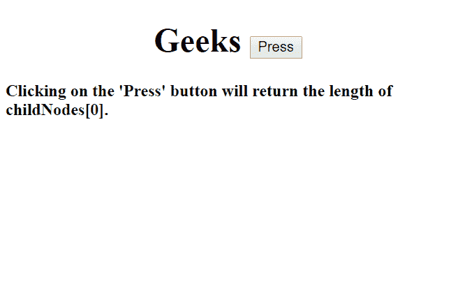
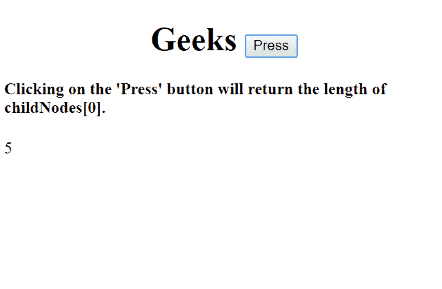
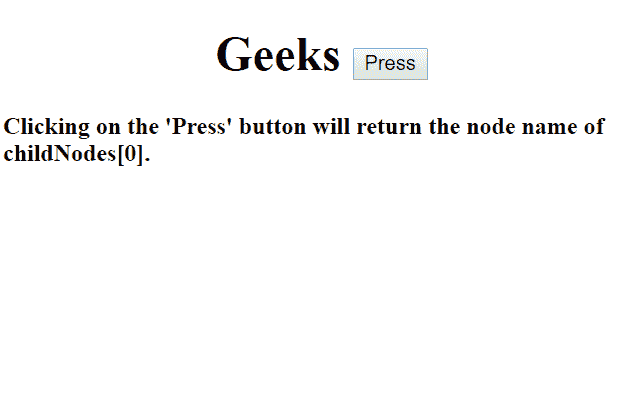
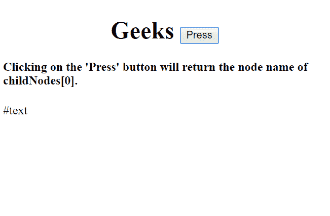
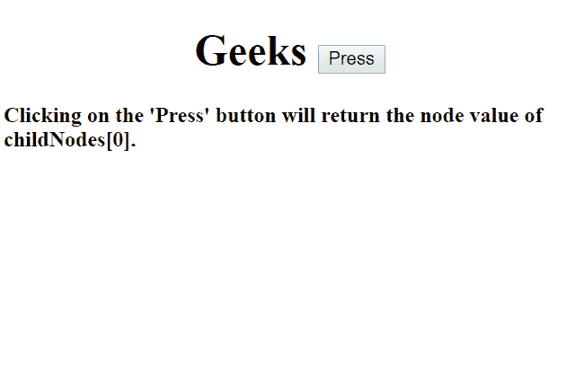
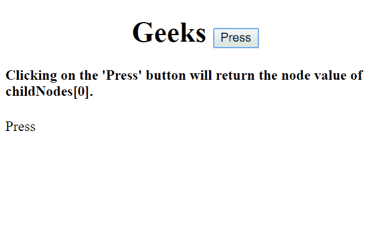

# HTML | DOM 子节点属性

> 原文: [https://www.geeksforgeeks.org/html-dom-childnodes-property/](https://www.geeksforgeeks.org/html-dom-childnodes-property/)

`childNodes` 属性返回一个节点的子节点作为 `NodeList` 对象。空格和注释也被认为是节点。从 `0` 开始，为节点分配索引号。搜索和排序操作可以使用节点列表上的索引号进行。

**语法:**

```html
elementNodeReference.childNodes;
```

**返回值:** 返回特定节点的子节点集合作为 `NodeList` 对象（包括空格、文本和注释，视为节点）。

## 属性

### 1. length 属性
它确定对象的子节点数量。这是一个只读属性。

**语法:**

```html
elementNodeReference.childNodes.length;
```

```html
elementNodeReference.childNodes[index_number].length;
```

**示例-1:** 显示长度属性。

```html
<!DOCTYPE html>
<html>

<body>
    <h1><center>Geeks
    <button onclick="node()">Press</button>
   </center> </h1>

<h4>Clicking on the 'Press' button will return 
          the length of childNodes[0].</h4>

<p id="gfg"></p>

<script>
        function node() {
            // Return the length of child node.
            var c = document.getElementsByTagName("BUTTON")[0];
            var x = c.childNodes[0].length;
            document.getElementById("gfg").innerHTML = x;
        }
    </script>

</body>

</html>
```

**输出:**

**点击按钮前:**


**点击按钮后:**


### 2. nodeName 属性
它返回指定节点的名称。如果节点是元素节点，它将返回标签名；如果节点是属性节点，它将返回属性名；对于不同的节点类型，将返回不同的名称。

**语法:**

```html
elementNodeReference.childNodes[index_number].nodeName;
```

**示例-2:** 显示节点名称属性

```html
<!DOCTYPE html>
<html>

<body>
    <h1><center>Geeks 
      <button onclick="node()">Press
      </button></center> </h1>

<h4>Clicking on the 'Press' button will 
          return the node name of childNodes[0].</h4>

<p id="gfg"></p>

<script>
        function node() {
            // Return the name of specific node name.
            var c = document.getElementsByTagName("BUTTON")[0];
            var x = c.childNodes[0].nodeName;
            document.getElementById("gfg").innerHTML = x;
        }
    </script>

</body>

</html>
```

**输出:**

**点击按钮前:**


**点击按钮后:**


### 3. nodeValue 属性
它设置或返回指定节点的节点值。

**语法:**

```html
elementNodeReference.childNodes[index_number].nodeValue;
```

**示例-3:** 显示节点值属性

```html
<!DOCTYPE html>
<html>

<body>
    <h1><center>Geeks 
      <button onclick="node()">Press
      </button></center> </h1>

<h4>Clicking on the 'Press' button will 
          return the node value of childNodes[0].</h4>

<p id="gfg"></p>

<script>
        function node() {
            // Return the node value.
            var c = document.getElementsByTagName("BUTTON")[0];
            var x = c.childNodes[0].nodeValue;
            document.getElementById("gfg").innerHTML = x;
        }
    </script>

</body>

</html>
```

**输出:**

**点击按钮前:**


**点击按钮后:**


**浏览器支持:** 列出的浏览器支持 `childNodes` 属性:

*   谷歌 Chrome
*   火狐浏览器
*   微软公司出品的 web 浏览器
*   歌剧
*   旅行队