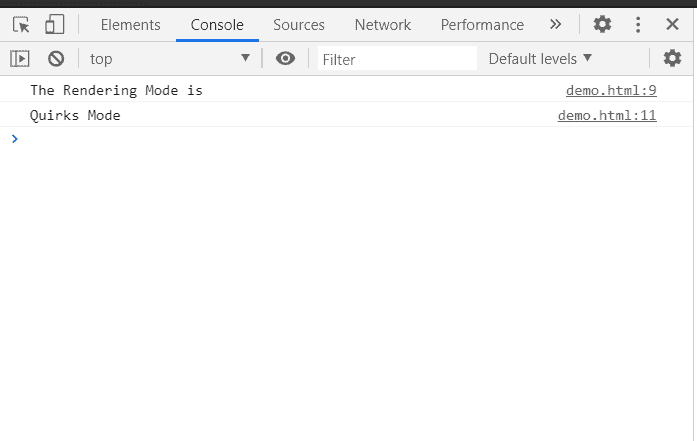

# HTML DOM 兼容模式属性

> 原文：[https://www.geeksforgeeks.org/html-dom-compatmode-property/](https://www.geeksforgeeks.org/html-dom-compatmode-property/)

HTML DOM 中的`compatMode`属性表示文档呈现的模式，例如怪异（Quirks）模式或标准（Standards）模式。

## 语法

```javascript
var mode = document.compatMode;
```

## 返回值

*   如果文档在怪异模式下渲染，返回`BackCompat`。
*   如果文档是以标准模式或有限怪异（也称为“几乎标准”）模式呈现的，则返回`CSS1Compat`。

## 示例

在本例中，我们将使用该属性获取文档模式。

### HTML

```html
<!DOCTYPE html>
<html>

<body>
    <h1>GeeksforGeeks</h1>

    <script>
        console.log("The Rendering Mode is");
        if (document.compatMode == "BackCompat") {
            console.log("Quirks Mode");
        }
        else {
            console.log("Standards Mode");
        }
    </script>
</body>

</html>
```

**输出：**



## 支持的浏览器

*   Google Chrome
*   Edge
*   Firefox
*   Opera
*   Safari