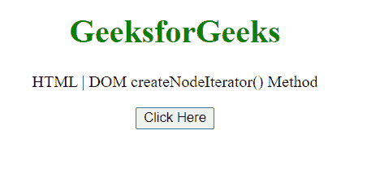
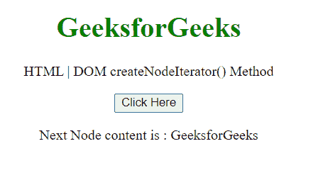
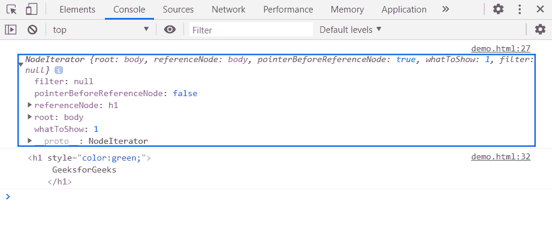

# HTML DOM createNodeIterator() 方法

> 原文：[https://www.geeksforgeeks.org/html-dom-createnodeiterator-method/](https://www.geeksforgeeks.org/html-dom-createnodeiterator-method/)

该方法用于创建一个节点迭代器，因此使用该节点迭代器我们可以对节点进行迭代。

## 语法

```javascript
const nodeIterator = document.createNodeIterator(root[, whatToShow[, filter]]);
```

## 参数

*   `root`：开始节点迭代器遍历的根节点。
*   `whatToShow`（可选）：这是一个可选参数，表示通过组合 `NodeFilter` 的常量属性创建的位掩码。以下是无符号常量的可能值。

| 常量 | 返回值 | 常量描述 |
| :--- | :--- | :--- |
| `NodeFilter.SHOW_ALL` | -1 | 显示所有节点。 |
| `NodeFilter.SHOW_COMMENT` | 128 | 显示注释节点。 |
| `NodeFilter.SHOW_DOCUMENT` | 256 | 显示文档节点。 |
| `NodeFilter.SHOW_DOCUMENT_FRAGMENT` | 1024 | 显示文档片段节点。 |
| `NodeFilter.SHOW_DOCUMENT_TYPE` | 512 | 显示文档类型节点。 |
| `NodeFilter.SHOW_ELEMENT` | 1 | 显示元素节点。 |
| `NodeFilter.SHOW_PROCESSING_INSTRUCTION` | 64 | 显示处理指令节点。 |
| `NodeFilter.SHOW_TEXT` | 4 | 显示文本节点。 |

*   `filter`（可选）：实现 `NodeFilter` 接口的对象。例如，`NodeFilter.FILTER_ACCEPT`。

## 返回值

这个方法返回一个 `NodeIterator` 对象。

## 示例

在本例中，我们将使用此方法创建一个节点迭代器，并将使用 `nextNode()` 方法进行迭代。

```html
<!DOCTYPE HTML>
<html>
<head>
    <meta charset="UTF-8">
    <title>HTML | DOM createNodeIterator() Method</title>
</head>

<body style="text-align:center;">
    <h1 style="color:green;">
        GeeksforGeeks
    </h1>
    <p>
        HTML | DOM createNodeIterator() Method
    </p>

    <button onclick="Geeks()">
        Click Here
    </button>
    <p id="a"></p>
    <script>
        var a = document.getElementById("a");
        function Geeks() {
            const nodeIterator = document.createNodeIterator(
                document.body,
                NodeFilter.SHOW_ELEMENT
            )
            console.log(nodeIterator)

            let nextNode = nodeIterator.nextNode();
            nextNode = nodeIterator.nextNode();
            a.innerHTML = 'Next Node content is : ' + nextNode.textContent;
            console.log(nextNode);
        }
    </script>
</body>
</html>
```

## 输出

**点击按钮前：**



**点击按钮后：**



**在控制台中：** 在控制台中，可以看到节点迭代器和下一个节点。



## 支持的浏览器

*   Google Chrome
*   Edge
*   Firefox
*   Safari
*   Opera
*   Internet Explorer