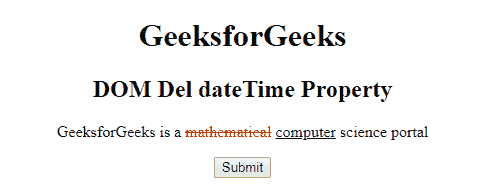
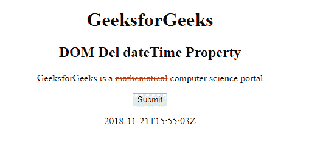
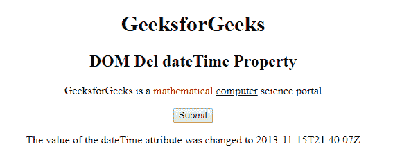

# HTML DOM del dateTime 属性

> 原文：[https://www.geeksforgeeks.org/html-dom-del-datetime-property/](https://www.geeksforgeeks.org/html-dom-del-datetime-property/)

**DOM del dateTime 属性**用于**设置**或**返回** `<del>` 元素的 `dateTime` 属性的值。此属性用于指定删除文本的日期和时间。日期时间以格式 `YYYY-MM-DDThh:mm:ssTZD` 插入。

## 语法

*   用于返回 `dateTime` 属性。

```html
delObject.dateTime
```

*   用于设置 `dateTime` 属性。

```html
delObject.dateTime = "YYYY-MM-DDThh:mm:ssTZD"
```

## 属性值

*   **YYYY-MM-DDThh:mm:ssTZD**：指定删除文本的日期和时间。

## 说明

*   **YYYY** – 年份（如 2009）
*   **MM** – 月份（如 01 代表一月）
*   **DD** – 一个月中的某一天（例如 08）
*   **T** – 所需的分隔符
*   **hh** – 小时（例如 22）
*   **mm** – 分钟（例如 55）
*   **ss** – 秒（例如 03）
*   **TZD** – 时区指示器（`Z` 表示祖鲁语，也称为格林威治标准时间）

## 返回值

返回一个字符串值，代表文本被删除的日期和时间。

## 示例 1：返回 dateTime 属性

```html
<!DOCTYPE html>
<html>
<head>
    <title>HTML DOM Del dateTime</title>
    <style>
        del {
            color: red;
        }
        ins {
            color: green;
        }
    </style>
</head>
<body style="text-align:center;">
    <h1>GeeksforGeeks</h1>
    <h2>DOM Del dateTime Property</h2>
    <p>
        GeeksforGeeks is a
        <del id="GFG" datetime="2018-11-21T15:55:03Z">mathematical</del>
        <ins>computer</ins> science portal
    </p>
    <button onclick="myGeeks()">Submit</button>
    <p id="sudo"></p>
    <script>
        function myGeeks() {
            var g = document.getElementById("GFG").dateTime;
            document.getElementById("sudo").innerHTML = g;
        }
    </script>
</body>
</html>
```

**输出：**

**点击按钮前：**


**点击按钮后：**


## 示例 2：设置 dateTime 属性

```html
<!DOCTYPE html>
<html>
<head>
    <title>HTML DOM Del dateTime</title>
    <style>
        del {
            color: red;
        }
        ins {
            color: green;
        }
    </style>
</head>
<body style="text-align:center;">
    <h1>GeeksforGeeks</h1>
    <h2>DOM Del dateTime Property</h2>
    <p>
        GeeksforGeeks is a
        <del id="GFG" datetime="2018-11-21T15:55:03Z">mathematical</del>
        <ins>computer</ins> science portal
    </p>
    <button onclick="myGeeks()">Submit</button>
    <p id="sudo"></p>
    <script>
        function myGeeks() {
            var g = document.getElementById("GFG").dateTime = "2013-11-15T21:40:07Z";
            document.getElementById("sudo").innerHTML = "The value of the dateTime attribute was changed to " + g;
        }
    </script>
</body>
</html>
```

**输出：**

**点击按钮前：**


**点击按钮后：**


## 支持的浏览器

以下列出了 **DOM Del dateTime 属性**支持的浏览器：

*   Google Chrome
*   Internet Explorer 10.0+
*   Firefox
*   Opera
*   Safari