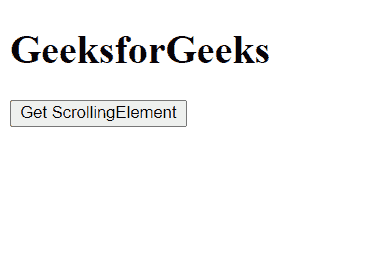
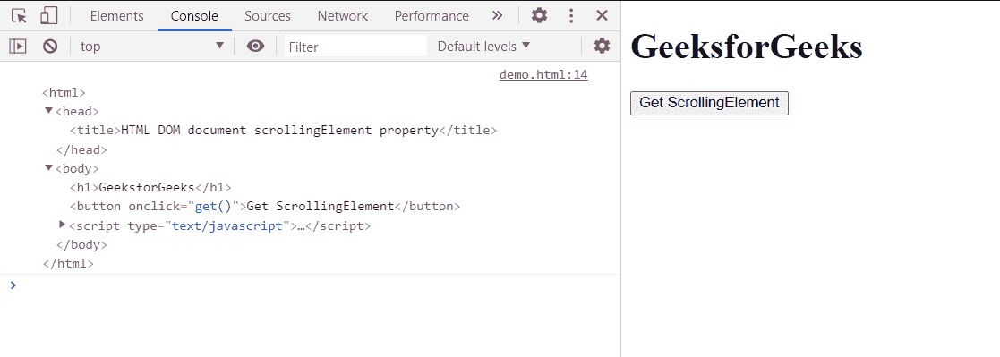

# HTML DOM 文档滚动元素属性

> 原文：[https://www.geeksforgeeks.org/html-dom-document-scrollingelement-property/](https://www.geeksforgeeks.org/html-dom-document-scrollingelement-property/)

文档的`scrollingElement`属性返回对元素的引用，该元素滚动文档。

在标准模式下，这是文档的根元素。而在怪癖模式中，它返回 HTML 主体元素或空值。

## 语法：

```html
var elem = document.scrollingElement;
```

## 返回值：

*   在标准模式下，返回文档的根元素。
*   在怪癖模式下，它返回 HTML 主体元素或空。

## 示例：

在本例中，我们使用该属性获取滚动元素。

### 超文本标记语言

```html
<!DOCTYPE html>
<html>

<body>
    <h1>GeeksforGeeks</h1>
    <button onclick="get()">
        Get ScrollingElement
    </button>

    <script type="text/javascript">
        function get() {
            var Elm = document.scrollingElement;
            Elm.scrollTop = 0;
            console.log(Elm)
        }
    </script>
</body>

</html>
```

### 输出：

*   **点击按钮前：**



*   **点击按钮后：**



### 支持的浏览器：

*   谷歌 Chrome
*   边缘
*   火狐浏览器
*   歌剧
*   旅行队