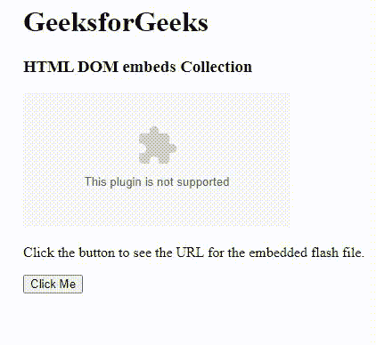

# HTML DOM 嵌入集合

> 原文：[https://www.geeksforgeeks.org/html-dom-embeds-collection/](https://www.geeksforgeeks.org/html-dom-embeds-collection/)

## 示例

这个示例演示了使用 DOM `embeds` 集合来获取嵌入式 flash 文件的 URL。

### HTML

```html
<!DOCTYPE html>
<html>
<body>
    <h1>GeeksforGeeks</h1>
    <h3>HTML DOM embeds Collection</h3>
    <embed id="gfgEmbed" src="gfg.swf">
    <p>
        Click the button to see the URL for the embedded flash file.
    </p>

<button onclick="gfg()">Click Me</button>
    <p id="show"></p>

<script>
    function gfg() {
        var g = document.getElementById("gfgEmbed").src;
        document.getElementById("show").innerHTML = "URL: " + g;
    }
    </script>
</body>
</html>
```

**输出：**



## 语法

```html
document.embeds
```

`DOM` 嵌入集合属性用于返回所有嵌入元素的集合。集合中的元素按出现在源代码中的顺序排列。此属性是只读的。

## 属性

该属性包含一个值 `length`，用于返回文档中嵌入元素的数量。

## 方法

`DOM` 嵌入集合包含三种方法，如下所示：

*   **[index]：** 用于返回所选索引的元素。索引值从 `0` 开始。如果索引值超出范围，则返回 `null`。
*   **item(index)：** 用于返回所选索引的 `<embed>` 元素。索引值从 `0` 开始。如果索引值超出范围，则返回 `null`。
*   **namedItem(id)：** 用于返回集合中给定 `id` 属性的 `<embed>` 元素。如果 `id` 无效，它将返回 `null`。

## 返回值

一个 `HTMLCollection` 对象，代表文档中所有的 `<embed>` 元素。集合中的元素按照在源代码中出现的顺序排序。

## 支持的属性

*   [HTML DOM 嵌入 `width` 属性](https://www.geeksforgeeks.org/html-dom-embed-width-property/)：用于设置或返回 `width` 属性的值。
*   [HTML DOM 嵌入 `type` 属性](https://www.geeksforgeeks.org/html-dom-embed-type-property/)：用于设置或返回嵌入元素中 `type` 属性的值。
*   [HTML DOM 嵌入 `src` 属性](https://www.geeksforgeeks.org/html-dom-embed-src-property/)：用于设置或返回嵌入元素中 `src` 属性的值。
*   [HTML DOM 嵌入 `height` 属性](https://www.geeksforgeeks.org/html-dom-embed-height-property/)：用于设置或返回 `height` 属性的值。

## 示例

这个示例演示了使用 `DOM embeds` 集合来获取 `embed` 元素的总数。

### HTML

```html
<!DOCTYPE html>
<html>
<head>
    <title>DOM embeds Collection</title>
</head>

<body>
    <h1>GeeksforGeeks</h1>
    <h2>HTML DOM embeds Collection</h2>
    <embed src="geeksforgeeks.swf">
    <embed src="geeksforgeeks.swf">
    <button onclick="geeks()">Count</button>
    <p id="cnt"></p>

<script>
    function geeks() {
        var x = document.embeds.length;
        document.getElementById("cnt").innerHTML = 
          "Number of embed Element is:" + x;
    }
    </script>
</body>
</html>
```

**输出：**


## 支持的浏览器

*   谷歌 Chrome 93.0 及以上
*   Internet Explorer 11.0
*   微软 Edge 93.0
*   火狐 92.0 及以上版本
*   Opera 79.0
*   Safari 14.1