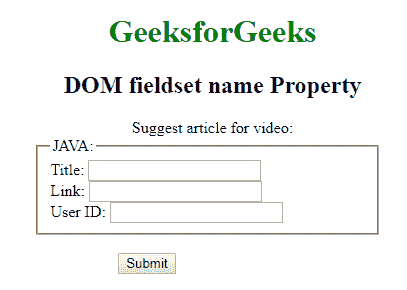
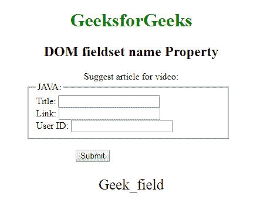
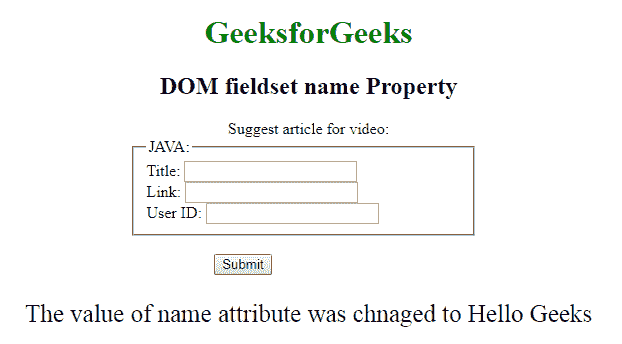

# HTML DOM fieldset name 属性

> 原文：[https://www.geeksforgeeks.org/html-dom-fieldset-name-property/](https://www.geeksforgeeks.org/html-dom-fieldset-name-property/)

`fieldset` name 属性用于设置或返回 `fieldset` 元素的 `name` 属性值。`name` 属性用于指定 `fieldset` 字段的名称。如果没有在输入字段中指定 `name` 属性，则根本不会发送该字段的数据。

## 语法

它返回 `fieldset` name 属性。

```html
fieldsetObject.name
```

它用于设置 `fieldset` name 属性。

```html
fieldsetObject.name = name
```

## 属性值

包含单个值 `name`，用于指定 `fieldset` 元素的名称。

## 返回值

返回一个代表 `fieldset` 元素名称的字符串值。

## 示例 1

本示例返回 `fieldset` name 属性。

```html
<!DOCTYPE html>
<html>
<head>
    <title>DOM fieldset name Property</title>
    <style>
        h1, h2, .title {
            text-align: center;
        }
        fieldset {
            width: 50%;
            margin-left: 22%;
        }
        h1 {
            color: green;
        }
        button {
            margin-left: 35%;
        }
    </style>
</head>
<body>
    <h1>GeeksforGeeks</h1>
    <h2>DOM fieldset name Property</h2>
    <form id="myGeeks">
        <div class="titl">Suggest article for video:</div>
        <fieldset id="GFG" name="Geek_field">
            <legend>JAVA:</legend>
            Title: <input type="text"><br>
            Link: <input type="text"><br>
            User ID: <input type="text">
        </fieldset>
    </form><br>
    <button onclick="Geeks()">Submit</button>
    <p id="sudo" style="font-size:25px;text-align:center;"></p>
    <!-- Script to use DOM fieldset name Property -->
    <script>
        function Geeks() {
            var g = document.getElementById("GFG").name;
            document.getElementById("sudo").innerHTML = g;
        }
    </script>
</body>
</html>
```

### 输出

*   **点击按钮前：**
    
*   **点击按钮后：**
    

## 示例 2

本示例设置 `fieldset` name 属性。

```html
<!DOCTYPE html>
<html>
<head>
    <title>DOM fieldset name Property</title>
    <style>
        h1, h2, .title {
            text-align: center;
        }
        fieldset {
            width: 50%;
            margin-left: 22%;
        }
        h1 {
            color: green;
        }
        button {
            margin-left: 35%;
        }
    </style>
</head>
<body>
    <h1>GeeksforGeeks</h1>
    <h2>DOM fieldset name Property</h2>
    <form id="myGeeks">
        <div class="titl">Suggest article for video:</div>
        <fieldset id="GFG" name="Geek_field">
            <legend>JAVA:</legend>
            Title: <input type="text"><br>
            Link: <input type="text"><br>
            User ID: <input type="text">
        </fieldset>
    </form><br>
    <button onclick="Geeks()">Submit</button>
    <p id="sudo" style="font-size:25px;text-align:center;"></p>
    <!-- Script to use DOM fieldset name Property -->
    <script>
        function Geeks() {
            var g = document.getElementById("GFG").name = "Hello Geeks";
            document.getElementById("sudo").innerHTML = "The value of name attribute was " + "chnaged to " + g;
        }
    </script>
</body>
</html>
```

### 输出

*   **点击按钮前：**
    
*   **点击按钮后：**
    

## 支持的浏览器

`fieldset` name 属性支持的浏览器如下：

*   Google Chrome
*   Firefox
*   Opera