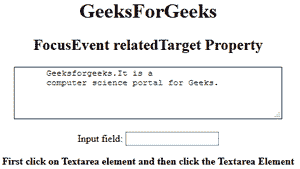
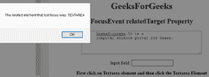

# HTML DOM FocusEvent relatedTarget 属性

> 原文：[https://www.geeksforgeeks.org/html-dom-focusevent-relatedtarget-property/](https://www.geeksforgeeks.org/html-dom-focusevent-relatedtarget-property/)

`DOM FocusEvent relatedTarget` 属性用于返回与触发聚焦/模糊事件的元素相关的元素的名称。它是只读属性。

*   对于 `onfocus` 和 `onfocusin` 事件，相关的元素是失去焦点的元素。
*   对于 `onblur` 和 `onfocusout` 事件，相关的元素是获得焦点的元素。

## 语法

```html
event.relatedTarget
```

## 返回值

返回对相关元素的引用，如果没有相关元素，则返回 `null`。

## 示例

```html
<!DOCTYPE html>
<html>

<body style="text-align:center;">
    <h1>GeeksForGeeks </h1>
    <h2>FocusEvent relatedTarget Property</h2>
    <textarea rows="4" 
              cols="50">
      Geeksforgeeks.It is a
      computer science portal for Geeks.
  </textarea>
    <br>
    <br> Input field:
    <input type="text"
           onfocus="RelatedElement(event)">
    <p><b>First click on Textarea element
      and then click the Textarea Element</b></p>
    <script>
        function RelatedElement(event) {
            alert(
              "The related element that lost focus was: " 
              + event.relatedTarget.tagName);
        }
    </script>

</body>

</html>
```

## 输出

**聚焦一个元素前:**



**聚焦一个元素后:**



## 支持的浏览器

`DOM FocusEvent relatedTarget` 属性支持的浏览器如下：

*   `Google Chrome`
*   `Internet Explorer 9.0`
*   `Firefox 24.0`
*   `Apple Safari`
*   `Opera`