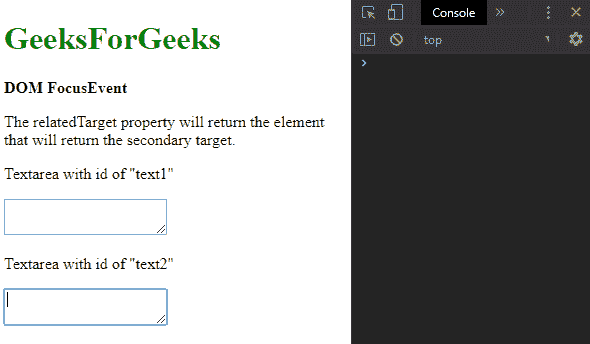
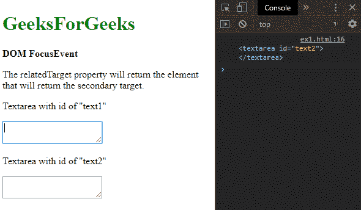
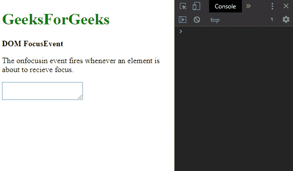
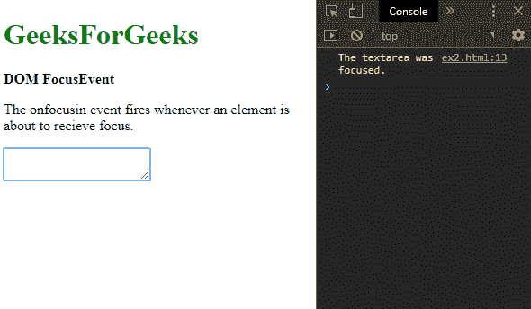
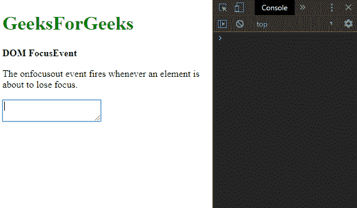
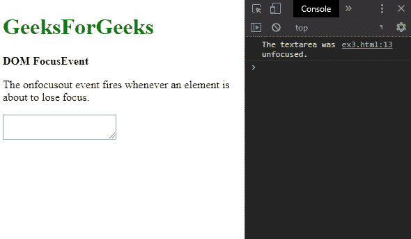

# HTML DOM FocusEvent

> 原文: [https://www.geeksforgeeks.org/html-dom-focusevent/](https://www.geeksforgeeks.org/html-dom-focusevent/)

**DOM `FocusEvent`** 对象包含与焦点相关的事件。它包括像 `focus`、`focusin` 和 `blur` 这样的事件。

## 属性

*   **`relatedTarget`**: 它返回与触发 `focus` 或 `blur` 事件的元素相关的元素。出于安全原因，该值默认设置为 `null`。它是只读属性。

## 示例：用 `relatedTarget` 属性找出相关事件

### HTML

```html
<!DOCTYPE html>
<html>

<head>
    <title>DOM FocusEvent</title>
</head>

<body>
    <h1 style="color: green">
        GeeksForGeeks
    </h1>

    <b>DOM FocusEvent</b>
    <p>
        The relatedTarget property will
        return the element that will
        return the secondary target.
    </p>

    <p>Textarea with id of "text1"</p>

    <textarea id="text1"
        onfocus="getRelatedTarget()">
    </textarea>

    <p>Textarea with id of "text2"</p>

    <textarea id="text2"></textarea>

    <script>
        function getRelatedTarget() {
            console.log(this.event.relatedTarget);
        }
    </script>
</body>

</html>
```

**输出:**

*   **聚焦第二个文本区:**
    
*   **重新聚焦第一个文本区域:**
    

## 事件类型

*   **`onblur`**: 每当元素失去焦点时，此事件就会触发。
*   **`onfocus`**: 每当元素获得焦点时，此事件就会触发。
*   **`onfocusin`**: 每当元素即将获得焦点时，此事件就会触发。
*   **`onfocusout`**: 每当元素即将失去焦点时，此事件就会触发。

## 示例：实现 `onfocusin` 事件

### HTML

```html
<!DOCTYPE html>
<html>

<head>
    <title>DOM FocusEvent</title>
</head>

<body>
    <h1 style="color: green">
        GeeksForGeeks
    </h1>

    <b>DOM FocusEvent</b>

    <p>
        The onfocusin event fires whenever an
        element is about to receive focus.
    </p>

    <textarea id="text1" onfocusin="fireEvent()">
    </textarea>

    <script>
        function fireEvent() {
            console.log("The textarea was focused.");
        }
    </script>
</body>

</html>
```

**输出:**

*   **点击文本区前:**
    
*   **点击后文字区:**
    

## 示例：实现 `onfocusout` 事件

### HTML

```html
<!DOCTYPE html>
<html>

<head>
    <title>DOM FocusEvent</title>
</head>

<body>
    <h1 style="color: green">
        GeeksForGeeks
    </h1>

    <b>DOM FocusEvent</b>

    <p>
        The onfocusout event fires whenever an
        element is about to lose focus.
    </p>

    <textarea id="text1" onfocusout="fireEvent()">
    </textarea>

    <script>
        function fireEvent() {
            console.log("The textarea was unfocused.");
        }
    </script>
</body>

</html>
```

**输出:**

*   **点击退出文字区前:**
    
*   **点击后退出**
    

## 支持的浏览器

`FocusEvent` 对象支持的浏览器如下:

*   Chrome
*   Firefox 24
*   Internet Explorer 9
*   Safari
*   Opera