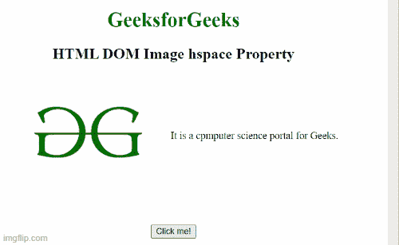

# HTML DOM 图像hspace属性

> 原文: [https://www.geeksforgeeks.org/html-dom-image-hspace-property/](https://www.geeksforgeeks.org/html-dom-image-hspace-property/)

`HTML DOM Image hspace` 属性用于设置或返回图像元素的 `hspace` 属性的值。`hspace` 属性用于指定图像左侧和右侧的空白区域数量。

**语法:**

它设置图像空间属性。

```html
Imageobject.hspace="pixels";
```

它返回图像空间属性。

```html
Imageobject.hspace;
```

**属性值:** 它包含指定图像左侧和右侧空格数量的值，即 `像素`。

## 示例1

下面的代码示例返回图像空间属性。

```html
<!DOCTYPE html>
<html>

<body>
    <center>
        <h1 style="color: green">GeeksforGeeks</h1>
        <h2>HTML DOM Image hspace Property</h2>

        <p> 
            It is a computer science portal for Geeks.
        </p>

        <br>
        <button onclick="Geeks()">Click me!</button>
        <p id="sudo"></p>

    </center>

    <script>
        function Geeks() {
            var g = document.getElementById("GFG").hspace;
            document.getElementById("sudo").innerHTML = g + "px";
        }
    </script>
</body>

</html>
```

**输出:**



## 示例2

在此示例中，代码设置了 Image hspace 属性。

```html
<!DOCTYPE html>
<html>

<body>
    <center>
        <h1 style="color: green">GeeksforGeeks</h1>
        <h2>HTML DOM Image hspace Property</h2>

        <p> 
            It is a computer science portal for Geeks.
        </p>

        <br>
        <button onclick="Geeks()">Click me!</button>
        <p id="sudo"></p>

    </center>

    <script>
        function Geeks() {
            var g = document.getElementById("GFG").hspace;
            document.getElementById("sudo").innerHTML = g + "px";
        }
    </script>
</body>

</html>
```

**输出:**

