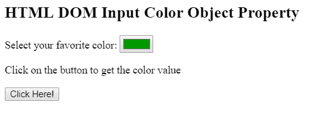
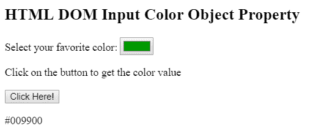

# HTML DOM 输入颜色对象

> 原文：[https://www.geeksforgeeks.org/html-dom-input-color-object/](https://www.geeksforgeeks.org/html-dom-input-color-object/)

HTML DOM 中的**输入颜色对象属性**用于创建和访问对象内的 `<input>` 元素。`<input>` 用于在输入栏中输入数据。允许用户输入数据的输入控件的声明可以通过 `<input>` 元素来完成，这些元素在 `<form>` 中使用。

## 语法

*   用于访问 `<input>` 元素。
    ```javascript
    var x = document.getElementById("myColor");
    ```
*   用于创建 `<input>` 元素。
    ```javascript
    var x = document.createElement("INPUT");
    ```

## 属性值

*   `autocomplete`: 用于设置或返回拾色器的自动完成属性。
*   `autofocus`: 用于页面自动对焦时设置或返回拾色器。
*   `defaultValue`: 用于设置或返回拾色器的默认值。
*   `disabled`: 用于设置或返回拾色器是否禁用。
*   `form`: 返回包含拾色器的表单的引用。
*   `list`: 返回包含拾色器的元素的引用。
*   `name`: 用于设置或返回拾色器的名称属性。
*   `type`: 返回拾色器的表单元素类型。
*   `value`: 用于设置或返回拾色器的值属性。

## 示例 1

本示例描述了使用 `getElementById()` 方法访问具有 `type = "color"` 属性的 `<input>` 元素。

```html
<!DOCTYPE html>
<html>

<head>
    <title>
        HTML DOM Input Color Object Property
    </title>
</head>

<body>

<h2>
        HTML DOM Input Color Object Property
    </h2>

<p>
        Select your favorite color:
        <input type = "color" value = "#009900"
            id = "color">
    </p>

<p>Click on the button to get the color value</p>

<button onclick = "myGeeks()">
        Click Here!
    </button>

<p id = "GFG"></p>

<!-- script to return the input color -->
    <script>
        function myGeeks() {
            var x = document.getElementById("color").value;
            document.getElementById("GFG").innerHTML = x;
        }
    </script>
</body>

</html>
```

**输出:**

**点击按钮前:**


**点击按钮后:**


## 示例 2

本示例描述了 `document.createElement()` 方法来创建具有 `type = "color"` 属性的 `<input>` 元素。

```html
<!DOCTYPE html>
<html>

<head>
    <title>
        HTML DOM Input Color Object Property
    </title>
</head>

<body>

<h2>
        HTML DOM Input Color Object Property
    </h2>

<button onclick = "myGeeks()">
        Click Here!
    </button>

<!-- script to create input color element -->
    <script>
        function myGeeks() {

/* Create input element */
            var x = document.createElement("INPUT");

/* Set color attribute */
            x.setAttribute("type", "color");

/* Set color value */
            x.setAttribute("value", "#009900");

document.body.appendChild(x);
        }
    </script>
</body>

</html>
```

**输出:**

**点击按钮前:**


**点击按钮后:**


## 支持的浏览器

*DOM 输入颜色对象属性*支持的浏览器如下：

*   Google Chrome
*   Microsoft Edge
*   Firefox
*   Safari
*   Opera

**注意:** Internet Explorer 11.0 及更早版本或 Safari 9.1 及更早版本不支持。