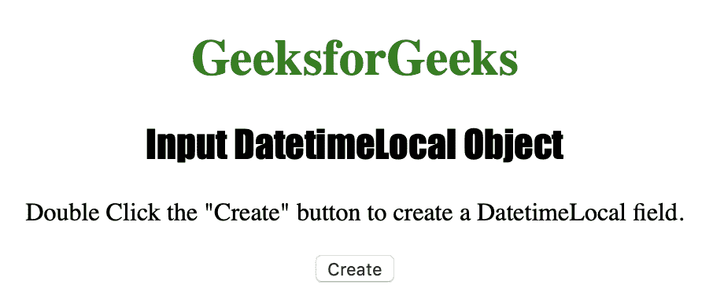
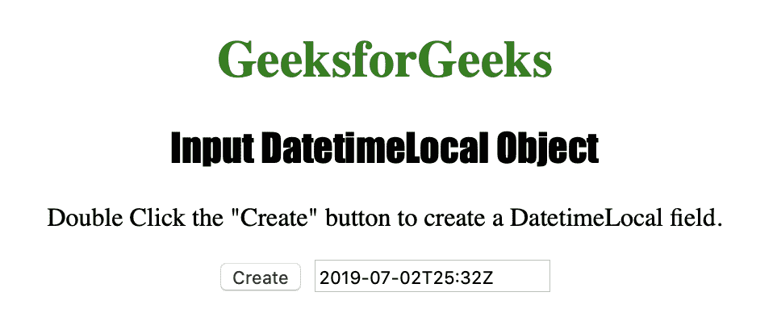
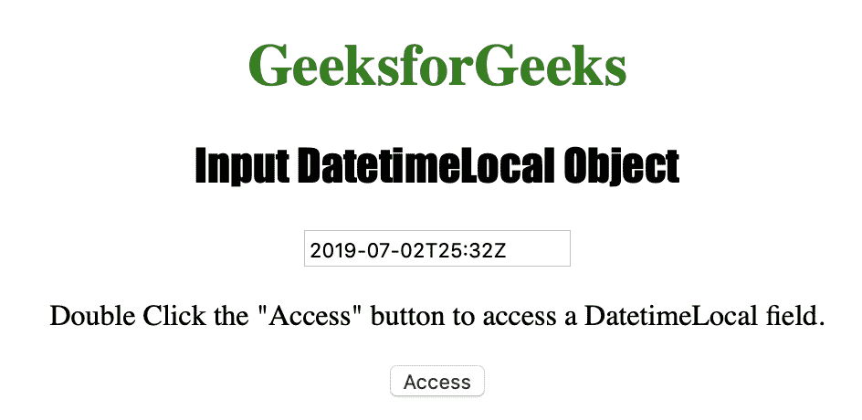
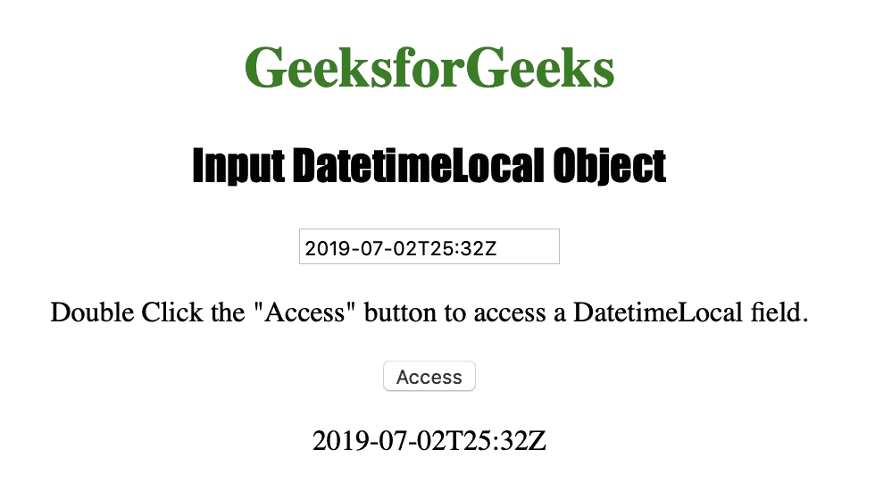

# HTML DOM Input DatetimeLocal 对象

> 原文：[https://www.geeksforgeeks.org/html-dom-input-datetimelocal-object/](https://www.geeksforgeeks.org/html-dom-input-datetimelocal-object/)

输入日期时间本地对象用于表示 `type="datetime-local"` 的 HTML `<input>` 元素。
输入日期时间本地对象是 HTML5 中的一个新对象。

## 语法

*   创建 `<input>` 元素，其类型为 `datetime-local`。
*   要访问 `<input>` 元素，其类型为 `datetime-local`。

## 属性值

| 属性 | 描述 |
| :--- | :--- |
| `autocomplete` | 它用于设置或返回日期时间字段的 `autocomplete` 属性的值。 |
| `autofocus` | 它用于设置或返回页面加载时日期时间字段是否应自动获得焦点。 |
| `defaultValue` | 它用于设置或返回日期时间字段的默认值。 |
| `disabled` | 它用于设置或返回日期时间字段是否被禁用。 |
| `form` | 它用于返回对包含日期时间字段的表单的引用。 |
| `list` | 它用于返回对包含 datetime 字段的 `datalist` 的引用。 |
| `max` | 它用于设置或返回日期时间字段的 `max` 属性值。 |
| `min` | 它用于设置或返回日期时间字段的 `min` 属性值。 |
| `name` | 它用于设置或返回日期时间字段的 `name` 属性值。 |
| `readOnly` | 它用于设置或返回日期时间字段是否为只读。 |
| `required` | 它用于设置或返回在提交表单之前是否必须填写日期时间字段。 |
| `step` | 它用于设置或返回日期时间字段的 `step` 属性值。 |
| `type` | 它用于返回日期时间字段是哪种类型的表单元素。 |
| `value` | 它用于设置或返回日期时间字段的 `value` 属性值。 |

## 输入日期时间本地对象方法

*   `stepDown()`：用于将日期时间字段的值递减指定的数字。
*   `stepUp()`：用于将日期时间字段的值增加一个指定的数字。

下面的程序说明了日期时间对象：

### 示例 1：创建一个类型为 `datetime-local` 的 `<input>` 元素

```html
<!DOCTYPE html>
<html>

<head>
    <title>Input DatetimeLocal Object</title>
    <style>
        h1 {
            color: green;
        }

        h2 {
            font-family: Impact;
        }

        body {
            text-align: center;
        }
    </style>
</head>

<body>

    <h1>GeeksforGeeks</h1>
    <h2>Input DatetimeLocal Object</h2>

    <p>Double Click the "Create" button to
        create a DatetimeLocal field.</p>

    <button ondblclick="Create()">
        Create
    </button>

    <script>
        function Create() {
            // Create input element type "datetime-local"
            var c = document.createElement("INPUT");
            c.setAttribute("type", "datetime-local");
            c.setAttribute("value", "2019-07-02T25:32Z");
            document.body.appendChild(c);
        }
    </script>

</body>

</html>
```

**输出：**

点击按钮前：


点击按钮后：


### 示例 2：访问类型为 `datetime-local` 的 `<input>` 元素

```html
<!DOCTYPE html>
<html>

<head>
    <title>Input Datetime Object</title>
    <style>
        h1 {
            color: green;
        }

        h2 {
            font-family: Impact;
        }

        body {
            text-align: center;
        }
    </style>
</head>

<body>

    <h1>GeeksforGeeks</h1>
    <h2>Input Datetime Object</h2>

    <input type="datetime"
           id="test"
           value="2019-07-02T25:32Z">

    <p>Double Click the "Access"
        button to access a Datetime field.</p>

    <button ondblclick="Access()">Access</button>

    <p id="check"></p>

    <script>
        function Access() {
            // Accessing input element type value
            var a = document.getElementById(
                "test").value;

            document.getElementById(
                "check").innerHTML = a;
        }
    </script>

</body>

</html>
```

**输出：**

点击按钮前：


点击按钮后：


## 支持的浏览器

*   Opera
*   Google Chrome
*   Apple Safari