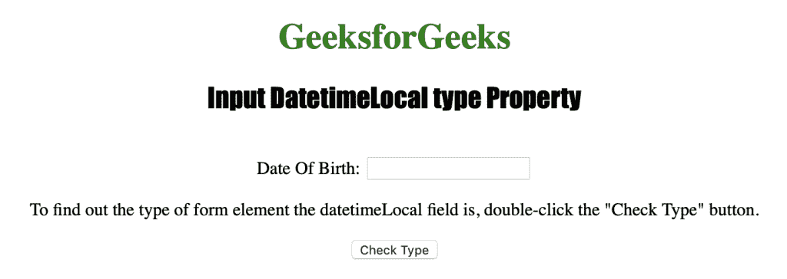
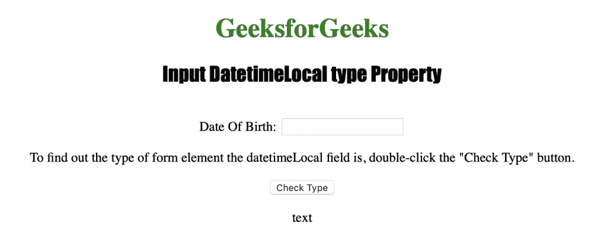

# HTML DOM 输入日期时间本地类型属性

> 原文：[https://www.geeksforgeeks.org/html-dom-input-datetimelocal-type-property/](https://www.geeksforgeeks.org/html-dom-input-datetimelocal-type-property/)

`input` `datetime-local` `type` 属性用于返回日期时间本地字段的表单元素类型。该属性返回一个字符串，该字符串表示日期时间本地字段的表单元素类型。结果，像 Safari 和 Opera 这样的浏览器返回 `"datetime-local"`，而像 Internet Explorer、Firefox 和 Chrome 这样的浏览器返回 `"text"`。

**语法**

`datetimelocalObject.type`

**返回值**：返回一个字符串值，代表 `DateTimeLocal` 字段的表单元素类型。

下面的程序说明了 `datetime-local` `type` 属性：**返回日期时间本地字段的表单元素类型。**

## 示例代码

```html
<!DOCTYPE html>
<html>

<head>
    <title>Input DatetimeLocal type Property in HTML</title>
    <style>
        h1 {
            color: green;
        }

        h2 {
            font-family: Impact;
        }

        body {
            text-align: center;
        }
    </style>
</head>

<body>

<h1>GeeksforGeeks</h1>
    <h2>Input DatetimeLocal type Property</h2>
    <br> Date Of Birth:
    <input type="datetime-local" id="Test_DatetimeLocal">

<p>To find out the type of form element the datetimeLocal field
        is, double-click the "Check Type" button.</p>

<button ondblclick="My_DatetimeLocal()">Check Type</button>

<p id="test"></p>

<script>
        function My_DatetimeLocal() {
            var t = document.getElementById("Test_DatetimeLocal").type;
            document.getElementById("test").innerHTML = t;
        }
    </script>

</body>

</html>
```

**输出：**

**点击按钮前：**



**点击按钮后：**



**支持的网络浏览器：**

*   苹果 Safari
*   微软公司出品的 web 浏览器
*   火狐浏览器
*   谷歌 Chrome
*   歌剧