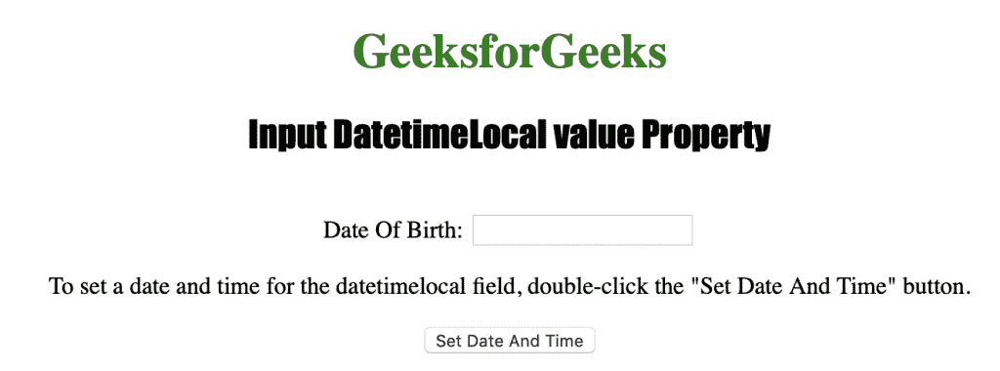
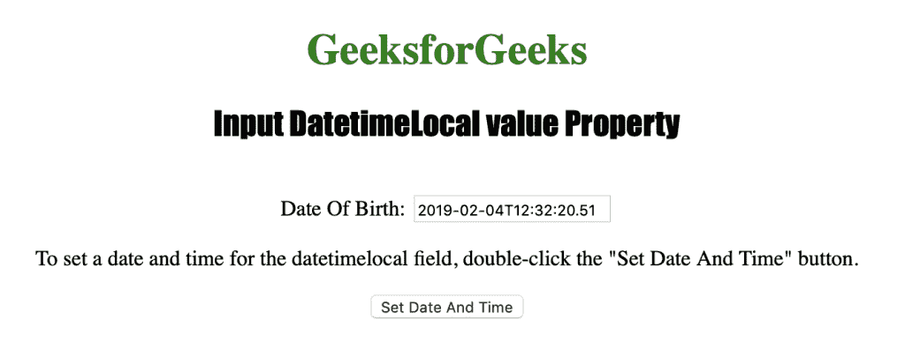

# HTML DOM Input datetimeLocal value 属性

> 原文：[https://www.geeksforgeeks.org/html-dom-input-datetimelocal-value-property/](https://www.geeksforgeeks.org/html-dom-input-datetimelocal-value-property/)

`datetimeLocal` value 属性用于设置或返回 `datetime-local` 字段的 `value` 属性的值。该属性可用于指定 `datetime-local` 字段的日期和时间。

## 语法

### 返回 value 属性

```html
datetimelocalObject.value
```

### 设置 value 属性

```html
datetimelocalObject.value = YYYY-MM-DDThh:mm:ss.ms
```

## 属性值

*   **YYYY-MM-DDThh:mm:ssTZD**：用于指定日期和/或时间。
    *   `YYYY`：指定年份。
    *   `MM`：指定月份。
    *   `DD`：指定一个月中的某一天。
    *   `T`：如果还输入了时间，它会指定分隔符。
    *   `hh`：指定小时。
    *   `mm`：指定分钟。
    *   `ss`：指定秒数。
    *   `ms`：指定毫秒。

## 返回值

返回一个字符串值，代表输入本地日期时间字段的日期和时间。

## 示例

以下程序说明了 `DatetimeLocal` value 属性：为 `datetimeLocal` 字段设置日期和时间。

### HTML

```html
<!DOCTYPE html>
<html>

<head>
    <title>Input DatetimeLocal value Property in HTML</title>
    <style>
        h1 {
            color: green;
        }

        h2 {
            font-family: Impact;
        }

        body {
            text-align: center;
        }
    </style>
</head>

<body>

    <h1>GeeksforGeeks</h1>
    <h2>Input DatetimeLocal value Property</h2>
    <br> Date Of Birth:
    <input type="datetime-local" id="Test_DatetimeLocal">

    <p>To set a date and time for the datetimeLocal field,
        double-click the "Set Date And Time" button.</p>

    <button ondblclick="My_DatetimeLocal()">Set Date And Time</button>

    <p id="test"></p>

    <script>
        function My_DatetimeLocal() {
            document.getElementById("Test_DatetimeLocal").value = "2019-02-04T12:32:20.51";
        }
    </script>

</body>

</html>
```

### 输出



### 点击按钮后



## 支持的浏览器

*   Apple Safari
*   Microsoft Edge
*   Firefox
*   Google Chrome
*   Opera