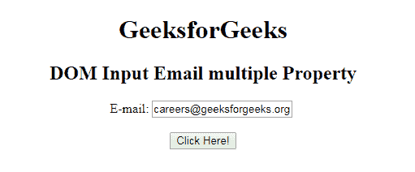
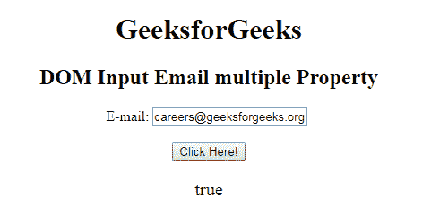
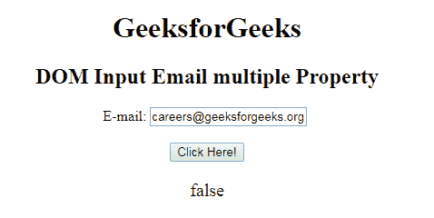

# HTML DOM 输入邮件多属性

> 原文：[https://www.geeksforgeeks.org/html-dom-input-email-multiple-property/](https://www.geeksforgeeks.org/html-dom-input-email-multiple-property/)

HTML DOM 中的 `Input Email multiple` 属性用于设置或返回是否允许用户在一个元素中输入多个值。它是一个布尔属性，用于返回电子邮件字段是否接受多个电子邮件值。它反映了 HTML 的 `multiple` 属性。提交表单时，多个电子邮件地址用逗号分隔。例如：`abc@gfg.com`、`careers@gfg.com`、`manas@gfg.com` 等。

## 语法

*   它返回输入电子邮件的 `multiple` 属性。

```html
emailObject.multiple
```

*   它用于设置输入电子邮件的 `multiple` 属性。

```html
emailObject.multiple = true|false
```

## 属性值

包含以下两个值：

*   `true`：接受多个值。
*   `false`：为默认值。它不接受多封邮件。

## 示例 1

此示例说明如何返回输入电子邮件的 `multiple` 属性。

```html
<!DOCTYPE html> 
<html>

<head> 
    <title> 
        HTML DOM Input Email multiple Property 
    </title> 
</head>

<body style="text-align:center;">

<h1> GeeksforGeeks</h1>

<h2>DOM Input Email multiple Property</h2>

E-mail: <input type="email" id="email"
            value="careers@geeksforgeeks.org" multiple>

<br><br>

<button onclick="myGeeks()"> 
        Click Here! 
    </button>

<p id="GFG" style="font-size:20px;color:green;"></p>

<!-- Script to use Input Email multiple Property -->
    <script> 
        function myGeeks() { 
            var em = document.getElementById("email").multiple; 
            document.getElementById("GFG").innerHTML = em; 
        } 
    </script> 
</body>

</html>
```

**输出：**

**点击按钮前：**


**点击按钮后：**


## 示例 2

本示例说明如何设置输入电子邮件的 `multiple` 属性。

```html
<!DOCTYPE html> 
<html>

<head> 
    <title> 
        HTML DOM Input Email multiple Property 
    </title> 
</head>

<body style="text-align:center;">

<h1> GeeksforGeeks</h1>

<h2>DOM Input Email multiple Property</h2>

E-mail: <input type="email" id="email"
            value="careers@geeksforgeeks.org" multiple>

<br><br>

<button onclick="myGeeks()"> 
        Click Here! 
    </button>

<p id="GFG" style="font-size:20px;color:green;"></p>

<!-- Script to use Input Email multiple Property -->
    <script> 
        function myGeeks() { 
            var em = document.getElementById("email").multiple
                    = "false"; 
            document.getElementById("GFG").innerHTML = em; 
        } 
    </script> 
</body>

</html>
```

**输出：**

**点击按钮前：**


**点击按钮后：**


## 支持的浏览器

`DOM Input Email multiple` 属性支持的浏览器如下：

*   谷歌 Chrome
*   Internet Explorer 10.0
*   火狐浏览器
*   Opera
*   Safari