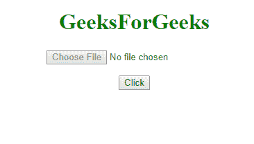
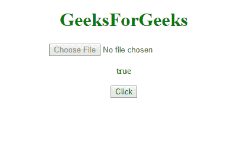
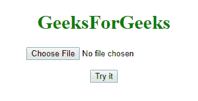
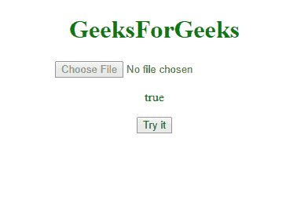

# HTML DOM 输入文件上传禁用属性

> 原文：[https://www.geeksforgeeks.org/html-dom-input-fileupload-disabled-property/](https://www.geeksforgeeks.org/html-dom-input-fileupload-disabled-property/)

HTML DOM 中的 `disabled` 属性用于**设置**或**返回**文件上传字段是否必须被禁用。禁用字段不可用且不可点击。它是一个布尔属性，用于反映 HTML `disabled` 属性。在所有浏览器中，默认情况下，它通常呈现为灰色。

## 语法

### 返回 disabled 属性

```html
fileuploadObject.disabled
```

### 设置 disabled 属性

```html
fileuploadObject.disabled = true | false
```

## 属性值

*   `true`：定义文件上传字段被禁用。
*   `false`：默认值。定义文件上传字段未被禁用。

## 返回值

返回一个布尔值，表示输入文件上传字段是否被禁用。

## 示例 1：返回文件上传属性

```html
<!DOCTYPE html>
<html>
<head>
    <title>
        DOM Input FileUpload disabled Property
    </title>
</head>
<body>
    <center>
        <h1 style="color:green;">
            GeeksForGeeks
        </h1>
        <input type="file"
               id="myFile"
               disabled="true">
        <p id="demo"></p>
        <button onclick="myFunction()">
            Click
        </button>
        <script>
            function myFunction() {
                var x = document.getElementById("myFile").disabled;
                document.getElementById("demo").innerHTML = x;
            }
        </script>
    </center>
</body>
</html>
```

**输出：**

**点击前：**


**点击后：**


## 示例 2：设置文件上传属性

```html
<!DOCTYPE html>
<html>
<head>
    <title>
        DOM Input FileUpload disabled Property
    </title>
</head>
<body>
    <center>
        <h1 style="color:green;">
            GeeksForGeeks
        </h1>
        <input type="file"
               id="myFile">
        <p id="demo"></p>
        <button onclick="myFunction()">
            Try it
        </button>
        <script>
            function myFunction() {
                var x = document.getElementById("myFile").disabled = "true";
                document.getElementById("demo").innerHTML = x;
            }
        </script>
    </center>
</body>
</html>
```

**输出：**

**点击前：**


**点击后：**


## 支持的浏览器

*   Google Chrome
*   Mozilla Firefox
*   Edge
*   Opera
*   Safari