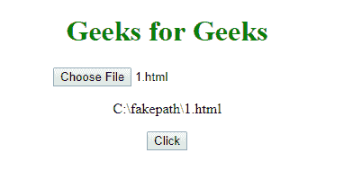

# HTML DOM Input FileUpload value 属性

> 原文：[https://www.geeksforgeeks.org/html-dom-input-fileupload-value-property/](https://www.geeksforgeeks.org/html-dom-input-fileupload-value-property/)

`Input FileUpload value` 属性用于返回用 `<input>` 元素选择的文件路径或名称。
该属性用于在 IE、Google Chrome、Opera 中返回路径为假的选中文件的名称，在 Firefox、Safari 中返回选中文件的名称。出于安全原因，此属性是只读的。

## 语法

```html
fileuploadObject.value
```

## 示例

返回文件路径。

```html
<!DOCTYPE html>
<html>

<head>
    <title>
        HTML DOM Input FileUpload value
    </title>
    <style>
        h1 {
            color: green;
        }
    </style>
</head>

<body>
    <center>
        <h1>
            Geeks for Geeks
        </h1>

        <input type="file"
               id="myFile"
               required>

        <p id="demo"></p>

        <button onclick="myFunction()">
            Click
        </button>

        <script>
            function myFunction() {
                var x =
                    document.getElementById(
                        "myFile").value;

                document.getElementById(
                    "demo").innerHTML = x;
            }
        </script>
    </center>
</body>

</html>
```

## 输出

**点击按钮前：**


**点击按钮后：**


## 支持的浏览器

*   Google Chrome
*   Mozilla Firefox
*   Edge 10.0
*   Opera
*   Apple Safari