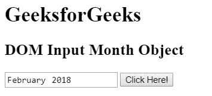
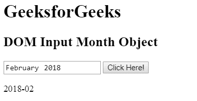
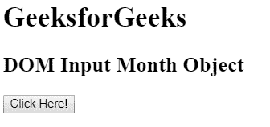
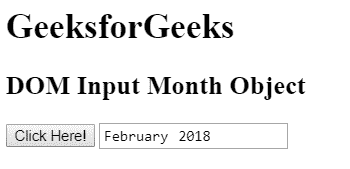

# HTML DOM 输入月份对象

> 原文：[https://www.geeksforgeeks.org/html-dom-input-month-object/](https://www.geeksforgeeks.org/html-dom-input-month-object/)

HTML DOM 中的**输入月份对象**用于表示具有 `type="month"` 属性的 HTML 输入元素。使用 `getElementById()` 方法可以访问具有 `type="month"` 属性的输入元素。

## 语法

*   用于访问 `type="month"` 属性的 `<input>` 元素。

```javascript
document.getElementById("id");
```

*   用于创建 `type="month"` 属性的 `<input>` 元素。

```javascript
document.createElement("input");
```

## 属性值

| 属性 | 描述 |
| :--- | :--- |
| `type` | 此属性用于返回月份字段的表单元素类型。 |
| `value` | 此属性用于设置或返回月份字段的 `value` 属性的值。 |
| `autocomplete` | 此属性用于设置或返回月份字段的自动完成属性的值。 |
| `autofocus` | 此属性用于设置或返回页面加载时月份字段是否应自动获得焦点。 |
| `defaultValue` | 此属性用于设置或返回月份字段的默认值。 |
| `disabled` | 此属性用于设置或返回月份字段是否被禁用。 |
| `form` | 此属性用于返回对包含月份字段的表单的引用。 |
| `list` | 此属性用于返回对包含月份字段的数据列表的引用。 |
| `max` | 此属性用于设置或返回月份字段的 `max` 属性的值。 |
| `min` | 此属性用于设置或返回月份字段的 `min` 属性的值。 |
| `name` | 此属性用于设置或返回月份字段的 `name` 属性的值。 |
| `placeholder` | 此属性用于设置或返回月份字段的 `placeholder` 属性的值。 |
| `readOnly` | 此属性用于设置或返回月份字段是否只读。 |
| `required` | 此属性用于设置或返回在提交表单前是否必须填写月份字段。 |
| `step` | 此属性用于设置或返回月份字段的 `step` 属性的值。 |

## 输入月份对象方法

| 方法 | 描述 |
| :--- | :--- |
| `stepDown()` | 此方法用于将输入月份的值递减指定的数字。 |
| `stepUp()` | 此方法用于将输入月份的值增加指定的数字。 |

## 示例 1

本示例使用 `getElementById()` 方法访问具有 `type="month"` 属性的 `<input>` 元素。

```html
<!DOCTYPE html>
<html>

<head>
    <title>
        HTML DOM Input Month Object
    </title>
</head>

<body>

<h1>GeeksforGeeks</h1>

<h2>DOM Input Month Object</h2>

<input type = "month" id = "month" value = "2018-02">

<button onclick = "myGeeks()">Click Here!</button>

<p id = "GFG"></p>

<!-- script to access input element of
        type month attribute -->
    <script>
        function myGeeks() {
            var val = document.getElementById("month").value;
            document.getElementById("GFG").innerHTML = val;
        }
    </script>
</body>

</html>
```

**输出：**

**点击按钮前：**



**点击按钮后：**



## 示例 2

本示例使用 `document.createElement()` 方法创建具有 `type="month"` 属性的 `<input>` 元素。

```html
<!DOCTYPE html>
<html>

<head>
    <title>
        HTML DOM Input Month Object
    </title>
</head>

<body>

<h1>GeeksforGeeks</h1>

<h2>DOM Input Month Object</h2>

<button onclick = "myGeeks()">Click Here!</button>

<!-- script to create input element of
        type month attribute -->
    <script>
        function myGeeks() {

/* Create an input element */
            var x = document.createElement("INPUT");

/* Set the type attribute */
            x.setAttribute("type", "month");

/* Set the value to type attribute */
            x.setAttribute("value", "2018-02");

/* Append the element to body tag */
            document.body.appendChild(x);
        }
    </script>
</body>

</html>
```

**输出：**

**点击按钮前：**



**点击按钮后：**



## 支持的浏览器

*   Google Chrome
*   Internet Explorer 11+
*   Opera
*   Safari