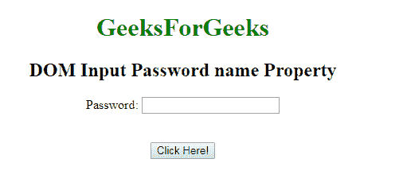
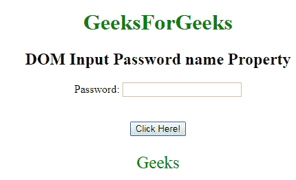
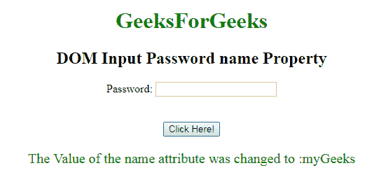

# HTML | DOM 输入密码名称属性

> 原文：[https://www.geeksforgeeks.org/html-dom-input-password-name-property/](https://www.geeksforgeeks.org/html-dom-input-password-name-property/)

**DOM 输入密码名称属性**用于设置或返回密码字段的`name`属性的值。每个输入字段都需要`name`属性。如果没有在输入字段中指定`name`属性，则根本不会发送该字段的数据。

**语法：**

*   它用于返回`name`属性。

```html
passwordObject.name
```

*   它用于设置`name`属性。

```html
passwordObject.name = name
```

**属性值：**

*   `name`：定义密码字段的名称。

**返回值：** 返回一个代表密码字段名称的字符串值。

**示例-1：** 本示例说明如何返回属性。

## 示例1：返回属性

```html
<!DOCTYPE html>
<html>

<body style="text-align:center;">

<h1 style="color:green;">
            GeeksForGeeks
        </h1>

<h2>DOM Input Password name Property</h2>

<form id="myGeeks">
    Password: <input type="password"
        id="myPsw"
        name="Geeks">
        </form>
    <br><br>
    <button onclick="myFunction()">
    Click Here!
</button>

<p id="demo" style="color:green;font-size:25px;"></p>

<script>
        function myFunction() {
            var x =
            document.getElementById(
            "myPsw").name;

document.getElementById(
            "demo").innerHTML = x;

}
    </script>

</body>

</html>
```

**输出：**
**点击按钮前：**



**点击按钮后：**



**示例-2：** 本示例说明如何设置属性。

## 示例2：设置属性

```html
<!DOCTYPE html>
<html>

<body style="text-align:center;">

<h1 style="color:green;">
            GeeksForGeeks
        </h1>

<h2>DOM Input Password name Property</h2>

<form id="myGeeks">
    Password: <input type="password"
        id="myPsw"
        name="Geeks">
        </form>
    <br><br>
    <button onclick="myFunction()">
    Click Here!
</button>

<p id="demo" style="color:green;font-size:20px;"></p>

<script>
        function myFunction() {
            var x =
            document.getElementById(
            "myPsw").name = "myGeeks";

document.getElementById(
            "demo").innerHTML =
        "The Value of the name attribute" +
        " was changed to :" + x;

}
    </script>

</body>

</html>
```

**输出：**
**点击按钮前：**


**点击按钮后：**



## 支持的浏览器

`DOM 输入密码名称属性`支持的浏览器如下：

*   谷歌 Chrome
*   微软公司出品的 web 浏览器
*   火狐浏览器
*   歌剧
*   旅行队