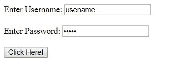
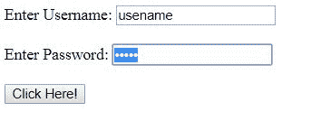

# HTML DOM Input Password select() 方法

> 原文: [https://www.geeksforgeeks.org/html-dom-input-password-select-method/](https://www.geeksforgeeks.org/html-dom-input-password-select-method/)

在选择密码字段的内容时，使用了 HTML DOM 中的 `Input Password select()` 方法。

## 语法

```html
passwordObject.select()
```

## 参数

不接受任何参数。

## 返回值

不返回值。

## 示例

本示例使用 `select()` 方法选择密码。

```html
<!DOCTYPE html>
<html>

<head>
    <title>
        HTML DOM Input Password select() Method
    </title>
</head>

<body>

Enter Username:
    <input type="text" 
           value="usename">
    <br>
    <br> Enter Password:
    <input type="password" 
           value="geeks"
           id="passwd">
    <br>
    <br>
    <button onclick="myGeeks()">
      Click Here!
  </button>

<script>
        function myGeeks() {
            document.getElementById(
              "passwd").select();
        }
    </script>
</body>

</html>
```

## 输出

**点击按钮前:**


**点击按钮后:**


## 支持的浏览器

以下是 `Input Password select()` 方法支持的浏览器:

*   谷歌 Chrome
*   微软公司出品的 web 浏览器
*   火狐浏览器
*   旅行队
*   歌剧