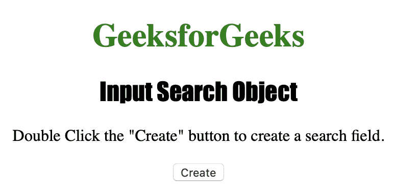
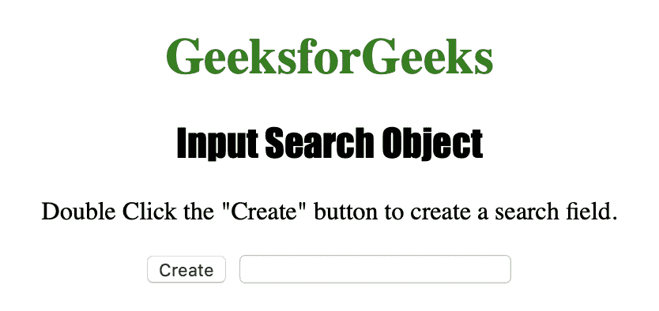
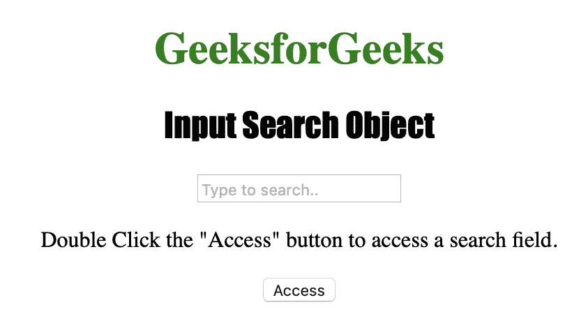
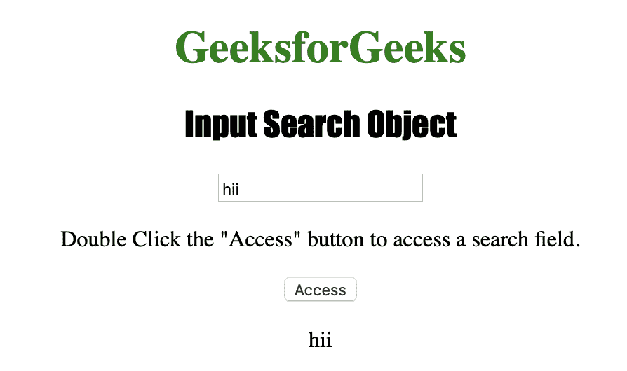

# HTML | DOM 输入搜索对象

> 原文: [https://www.geeksforgeeks.org/html-dom-input-search-object/](https://www.geeksforgeeks.org/html-dom-input-search-object/)

**输入搜索对象**用于表示类型为`search`的`<input>`元素的 HTML DOM。输入搜索对象是 HTML5 中的新对象。

## 语法

*   要创建一个`<input>`元素。
*   用于访问的语法使用 `type="search"`：

```javascript
var s = document.getElementById("search_object");
```

## 属性值

| 值 | 描述 |
| :--- | :--- |
| autocomplete | 它用于设置或返回搜索字段的 `autocomplete` 属性的值。 |
| autofocus | 它用于设置或返回页面加载时搜索字段是否应自动获得焦点。 |
| defaultValue | 它用于设置或返回搜索字段的默认值。 |
| disabled | 它用于设置或返回搜索字段是否被禁用。 |
| form | 它用于返回对包含搜索字段的表单的引用。 |
| list | 它用于返回对包含搜索字段的 `datalist` 的引用。 |
| max | 它用于设置或返回搜索字段的 `max` 属性值。 |
| min | 它用于设置或返回搜索字段的 `min` 属性值。 |
| name | 它用于设置或返回搜索字段的 `name` 属性值。 |
| readOnly | 它用于设置或返回搜索字段是否为只读。 |
| required | 用于设置或返回提交表单前是否必须填写搜索字段。 |
| step | 它用于设置或返回搜索字段的 `step` 属性值。 |
| type | 它用于返回搜索字段是哪种类型的表单元素。 |
| value | 它用于设置或返回搜索字段的 `value` 属性的值。 |

下面的程序说明了搜索对象：

## 示例

### 示例-1：创建一个类型为“search”的`<input>`元素。

```html
<!DOCTYPE html>
<html>

<head>
    <title>Input Search Object</title>
    <style>
        h1 {
            color: green;
        }

        h2 {
            font-family: Impact;
        }

        body {
            text-align: center;
        }
    </style>
</head>

<body>

    <h1>GeeksforGeeks</h1>
    <h2>Input Search Object</h2>

    <p>Double Click the "Create" button to create a search field.</p>

    <button ondblclick="Create()">Create</button>

    <script>
        function Create() {
            // Create input element with type search.
            var s = document.createElement("INPUT");
            s.setAttribute("type", "search");
            document.body.appendChild(s);
        }
    </script>

</body>

</html>
```

**输出：**

**点击按钮前：**


**点击按钮后：**


### 示例-2：访问类型为`type="search"`的`<input>`元素。

```html
<!DOCTYPE html>
<html>

<head>
    <title>Input Search Object</title>
    <style>
        h1 {
            color: green;
        }

        h2 {
            font-family: Impact;
        }

        body {
            text-align: center;
        }
    </style>
</head>

<body>

    <h1>GeeksforGeeks</h1>
    <h2>Input Search Object</h2>

    <input type="Search" id="test" placeholder="Type to search..">

    <p>Double Click the "Access" button to access a search field.</p>

    <button ondblclick="Access()">Access</button>

    <p id="check"></p>

    <script>
        function Access() {
            // Accessing value of input element type="search"
            var s = document.getElementById("test").value;
            document.getElementById("check").innerHTML = s;
        }
    </script>

</body>

</html>
```

**输出：**

**点击按钮前：**


**点击按钮后：**


## 支持的浏览器

*   Opera
*   Microsoft Edge
*   Firefox
*   Google Chrome
*   Safari