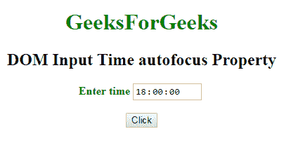
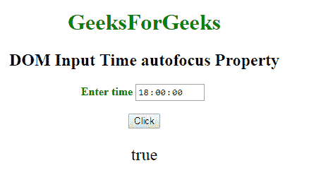
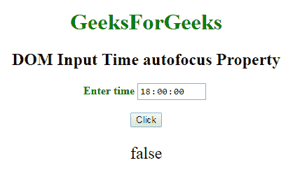

# HTML DOM 输入时间自动对焦属性

> 原文：[https://www.geeksforgeeks.org/html-dom-input-time-autofocus-property/](https://www.geeksforgeeks.org/html-dom-input-time-autofocus-property/)

HTML DOM 中的 `autofocus` 属性用于设置或返回当页面加载时时间字段是否自动对焦。该属性用于反映 HTML `autofocus` 属性。

## 语法

### 获取属性
它返回 `autofocus` 属性。

```html
timeObject.autofocus
```

### 设置属性
它用于设置 `autofocus` 属性。

```html
timeObject.autofocus = true|false
```

## 属性值

*   `true`: 指定时间字段获得焦点。
*   `false`: 默认值。指定时间字段没有获得焦点。

## 返回值
返回一个布尔值，表示页面加载时时间域是否聚焦。

## 示例

### 示例-1
本例说明了如何获取属性。

```html
<!DOCTYPE html>
<html>

<head>
    <title>
        DOM Input Time autofocus Property
    </title>
</head>

<body>
    <center>
        <h1 style="color:green;"> 
                GeeksForGeeks 
            </h1>

<h2>
          DOM Input Time autofocus Property
      </h2>

<label for="uname" 
               style="color:green">
            <b>Enter time</b>
        </label>

<input type="time" 
               id="gfg" 
               name="Geek_time" 
               value="18:00" 
               placeholder="Enter time"
               step="5" 
               min="16:00" 
               max="22:00:" 
               autofocus>

<br>
        <br>

<button type="button" 
                onclick="geeks()">
            Click
        </button>

<p id="GFG"
           style="font-size:24px;
                  color:green'">
      </p>

<script>
            function geeks() {

var link = 
                    document.getElementById(
                      "gfg").autofocus;

document.getElementById(
                  "GFG").innerHTML = link;
            }
        </script>
    </center>
</body>

</html>
```

**输出:**

**点击按钮前:**


**点击按钮后:**


### 示例-2
本示例说明如何设置属性。

```html
<!DOCTYPE html>
<html>

<head>
    <title>
        DOM Input Time autofocus Property
    </title>
</head>

<body>
    <center>
        <h1 style="color:green;"> 
                GeeksForGeeks 
            </h1>

<h2>DOM Input Time autofocus Property</h2>

<label for="uname" 
               style="color:green">
            <b>Enter time</b>
        </label>

<input type="time" 
               id="gfg" 
               name="Geek_time" 
               value="18:00"
               placeholder="Enter time" 
               step="5" 
               min="16:00" 
               max="22:00:" 
               autofocus>

<br>
        <br>

<button type="button" 
                onclick="geeks()">
            Click
        </button>

<p id="GFG" 
           style="font-size:24px;
                  color:green'">
      </p>

<script>
            function geeks() {

var link =
                    document.getElementById(
                      "gfg").autofocus = false;

document.getElementById(
                  "GFG").innerHTML = link;
            }
        </script>
    </center>
</body>

</html>
```

**输出:**
**点击按钮前:**


**点击按钮后:**


## 支持的浏览器
以下列出的 `autofocus` 属性支持的浏览器:

*   谷歌 Chrome
*   Internet Explorer 10.0 +
*   火狐浏览器
*   歌剧
*   旅行队