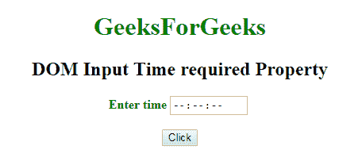
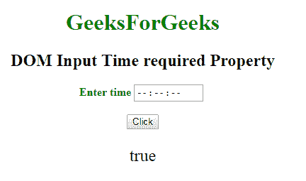
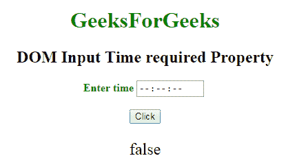

# HTML DOM Input time required 属性

> 原文：[https://www.geeksforgeeks.org/html-dom-input-time-required-property/](https://www.geeksforgeeks.org/html-dom-input-time-required-property/)

`DOM输入时间所需属性`用于**设置**或**返回**提交表单时是否必须填写时间输入字段。此属性用于反映 HTML 的 `required` 属性。

## 语法

- 它返回 `time` 输入的 `required` 属性。

```html
timeObject.required
```

- 它用于设置 `time` 输入的 `required` 属性。

```html
timeObject.required = true|false
```

## 属性值

- `true`：指定提交表单前必须填写时间字段。
- `false`：默认值。指定提交表单前不必填写时间字段。

## 返回值

返回一个布尔值，表示提交表单前是否必须填写时间字段。

## 示例-1

本示例返回 `required` 属性。

```html
<!DOCTYPE html>
<html>

<head>
    <title>
        DOM Input Time required Property
    </title>
</head>

<body>
    <center>
        <h1 style="color:green;">
            GeeksForGeeks
        </h1>

        <h2>
            DOM Input Time required Property
        </h2>

        <label for="uname"
               style="color:green">
            <b>Enter time</b>
        </label>

        <input type="time"
               id="gfg"
               placeholder="Enter time"
               step="5"
               required>

        <br>
        <br>

        <button type="button"
                onclick="geeks()">
            Click
        </button>

        <p id="GFG"
           style="font-size:24px;
                  color:green'">
        </p>

        <script>
            function geeks() {
                var link =
                    document.getElementById(
                        "gfg").required;

                document.getElementById(
                    "GFG").innerHTML = link;
            }
        </script>
    </center>
</body>

</html>
```

**输出：**

**点击按钮前：**


**点击按钮后：**


## 示例-2

本示例说明了如何**设置** `required` 属性。

```html
<!DOCTYPE html>
<html>

<head>
    <title>
        DOM Input Time required Property
    </title>
</head>

<body>
    <center>
        <h1 style="color:green;">
            GeeksForGeeks
        </h1>

        <h2>
            DOM Input Time required Property
        </h2>

        <label for="uname"
               style="color:green">
            <b>Enter time</b>
        </label>

        <input type="time"
               id="gfg"
               placeholder="Enter time"
               step="5"
               required>

        <br>
        <br>

        <button type="button"
                onclick="geeks()">
            Click
        </button>

        <p id="GFG"
           style="font-size:24px;
                  color:green'">
        </p>

        <script>
            function geeks() {
                var link =
                    document.getElementById(
                        "gfg").required = false;

                document.getElementById(
                    "GFG").innerHTML = link;
            }
        </script>
    </center>
</body>

</html>
```

**输出：**

**点击按钮前：**


**点击按钮后：**


## 支持的浏览器

`DOM输入时间所需属性`支持的浏览器如下：

- 谷歌 Chrome
- Internet Explorer 10.0 +
- 火狐浏览器
- 歌剧
- 旅行队