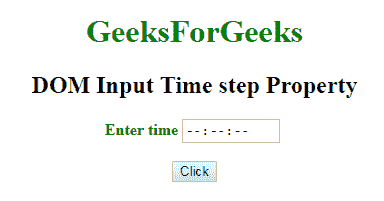
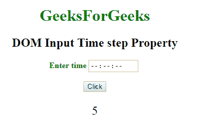
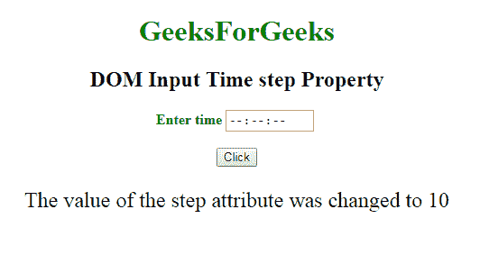

# HTML | DOM 输入时间步长属性

> 原文: [https://www.geeksforgeeks.org/html-dom-input-time-step-property/](https://www.geeksforgeeks.org/html-dom-input-time-step-property/)

**DOM 输入时间步长属性**用于**设置**或**返回** `time` 字段的 `step` 属性值。HTML 中的 `step` 属性用于在时间字段中指定秒和毫秒的合法间隔。`step` 属性可以与 `min` 和 `max` 属性一起使用来定义合法值范围。
**例如**，如果 `step` 属性的值为 `"2"`，则合法数字将是 0，2，4，6，8 等。

## 语法

它返回 `step` 属性。

```html
timeObject.step
```

它用于设置 `step` 属性。

```html
timeObject.step = number
```

## 属性值

它包含一个数字值，用于指定时间字段的合法间隔。

## 秒

*   当秒数将达到 60 时，使用数字 `"1"`、`"2"`、`"10"` 或 `"30"`。

## 毫秒

*   它以点（`.`）开始，当毫秒数将达到 1000 时，使用数字 `".010"`、`".050"`、`".20"`。

## 返回值

返回一个字符串值，代表秒或毫秒的合法数字间隔。

## 示例-1

本示例说明如何返回属性。

```html
<!DOCTYPE html>
<html>
<head>
    <title>
        DOM Input Time step Property
    </title>
</head>
<body>
    <center>
        <h1 style="color:green;">
            GeeksForGeeks
        </h1>
        <h2>DOM Input Time step Property</h2>
        <label for="uname" style="color:green">
            <b>Enter time</b>
        </label>
        <input type="time" id="gfg" placeholder="Enter time" step="5">
        <br>
        <br>
        <button type="button" onclick="geeks()">
            Click
        </button>
        <p id="GFG" style="font-size:24px; color:green'">
        </p>
        <script>
            function geeks() {
                var link = document.getElementById("gfg").step;
                document.getElementById("GFG").innerHTML = link;
            }
        </script>
    </center>
</body>
</html>
```

**输出:**

**点击按钮前:**


**点击按钮后:**


## 示例-2

本示例说明如何**设置**属性。

```html
<!DOCTYPE html>
<html>
<head>
    <title>
        DOM Input Time step Property
    </title>
</head>
<body>
    <center>
        <h1 style="color:green;">
            GeeksForGeeks
        </h1>
        <h2>
            DOM Input Time step Property
        </h2>
        <label for="uname" style="color:green">
            <b>Enter time</b>
        </label>
        <input type="time" id="gfg" placeholder="Enter time" step="5">
        <br>
        <br>
        <button type="button" onclick="geeks()">
            Click
        </button>
        <p id="GFG" style="font-size:24px; color:green'">
        </p>
        <script>
            function geeks() {
                var link = document.getElementById("gfg").step = "10";
                document.getElementById("GFG").innerHTML =
                    "The value of the step attribute" +
                    " was changed to " + link;
            }
        </script>
    </center>
</body>
</html>
```

**输出:**

**点击按钮前:**


**点击按钮后:**


## 支持的浏览器

`DOM Input Time step` 属性支持的浏览器如下:

*   谷歌 Chrome
*   Internet Explorer 10.0 +
*   火狐浏览器
*   歌剧
*   旅行队