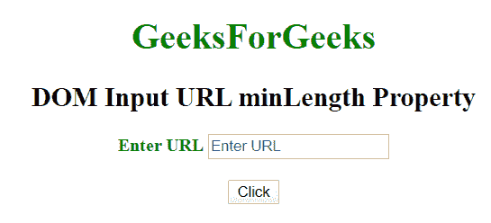
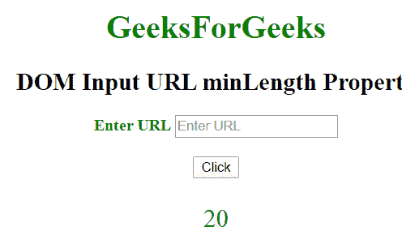
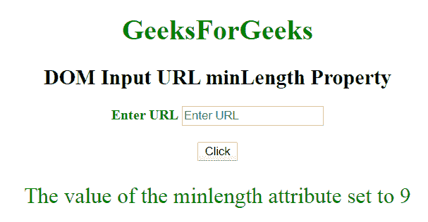

# HTML DOM 输入 URL 最小长度属性

> 原文: [https://www.geeksforgeeks.org/html-dom-input-url-minlength-property/](https://www.geeksforgeeks.org/html-dom-input-url-minlength-property/)

HTML DOM 中的输入网址最小长度属性用于设置或返回网址输入字段的最小长度属性值。它指定了 URL 字段中允许的最小字符数。

## 语法

它返回输入 url 的最小长度属性。

```html
urlObject.minLength
```

它用于设置输入 url 的 `minLength` 属性。

```html
urlObject.minLength = number
```

## 属性值

它包含单个数值，用于指定网址最小长度字段中允许的最小字符数。

## 返回值

它返回一个数值，该数值表示在网址最小长度字段中允许的最小字符数。

## 示例 1

这个示例说明了如何返回输入 URL 的 `minLength` 属性。

```html
<!DOCTYPE html>
<html>
<head>
    <title>
        DOM Input URL minLength Property
    </title>
</head>
<body>
    <center>
        <h1 style="color:green;">
            GeeksForGeeks
        </h1>
        <h2>
            DOM Input URL minLength Property
        </h2>
        <label for="uname" style="color:green">
            <b>Enter URL</b>
        </label>
        <input type="url" id="gfg" placeholder="Enter URL"
               size="20" pattern="https?://.+"
               title="Include http://" minlength="20">
        <br><br>
        <button type="button" onclick="geeks()">
            Click
        </button>
        <p id="GFG" style="color:green; font-size:25px;">
        </p>
        <script>
            function geeks() {
                var link = document.getElementById("gfg").minLength;
                document.getElementById("GFG").innerHTML = link;
            }
        </script>
    </center>
</body>
</html>
```

### 输出

*   **点击按钮前:**
    
*   **点击按钮后:**
    

## 示例 2

本示例说明如何设置输入网址最小长度属性。

```html
<!DOCTYPE html>
<html>
<head>
    <title>
        DOM Input URL minLength Property
    </title>
</head>
<body>
    <center>
        <h1 style="color:green;">
            GeeksForGeeks
        </h1>
        <h2>
            DOM Input URL minLength Property
        </h2>
        <label for="uname" style="color:green">
            <b>Enter URL</b>
        </label>
        <input type="url" id="gfg" placeholder="Enter URL"
               size="20" pattern="https?://.+"
               title="Include http://" minlength="20">
        <br><br>
        <button type="button" onclick="geeks()">
            Click
        </button>
        <p id="GFG" style="color:green; font-size:25px;">
        </p>
        <script>
            function geeks() {
                var link = document.getElementById("gfg").minLength = "9";
                document.getElementById("GFG").innerHTML
                    = "The value of the minlength "
                    + "attribute set to " + link;
            }
        </script>
    </center>
</body>
</html>
```

### 输出

*   **点击按钮前:**
    
*   **点击按钮后:**
    

## 支持的浏览器

DOM 输入 URL 最小长度属性支持的浏览器如下:

*   谷歌 Chrome
*   微软公司出品的 web 浏览器
*   火狐浏览器
*   苹果 Safari
*   歌剧