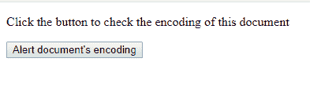
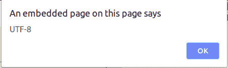

# HTML | DOM 输入编码属性

> 原文: [https://www.geeksforgeeks.org/html-dom-inputencoding-property/](https://www.geeksforgeeks.org/html-dom-inputencoding-property/)

`inputEncoding` 属性返回用于解析文档的字符编码。此属性没有任何默认值。

## 语法:

```html
document.inputEncoding
```

## 参数:

*   HTML DOM `inputEncoding` 属性不需要任何参数。

## 返回值:

*   HTML DOM `inputEncoding` 属性返回一个表示文档字符编码的字符串。

## 示例:

```html
<!DOCTYPE html>
<html>
<head>
    <title>
        HTML | DOM inputEncoding Property
    </title>
</head>
<body>
    <p>
        Click the button to check the
        encoding of this document
    </p>
    <button onclick="geek()">
        Alert document's encoding
    </button>
    <script>
        function geek() {
            var docEncoding = document.inputEncoding;
            alert(docEncoding);
        }
    </script>
</body>
</html>
```

## 输出:

**点击按钮前:**


**点击按钮后:**


## 支持的浏览器:

支持 HTML DOM `inputEncoding` 属性的浏览器如下:

*   谷歌 Chrome
*   Internet Explorer 9.0+
*   火狐浏览器
*   Opera 15.0+
*   旅行队