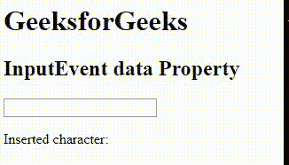

# HTML DOM 输入事件数据属性

> 原文：[https://www.geeksforgeeks.org/html-dom-inputevent-data-property/](https://www.geeksforgeeks.org/html-dom-inputevent-data-property/)

HTML DOM 中的 `InputEvent` 数据属性用于返回使用事件插入的字符。`InputEvent` 数据属性是一个只读属性，它返回一个代表插入字符的字符串。

## 语法

```html
event.data
```

## 返回值

从文本字段返回输入数据。

## 示例

下面的程序用 HTML 说明了输入事件数据属性：

```html
<!DOCTYPE html>
<html>

<head> 
    <title>
        HTML DOM InputEvent data Property
    </title> 
</head>

<body>
    <h1>GeeksforGeeks</h1>

    <h2>InputEvent data Property</h2>

    <input type="text" id="GFG" oninput="myGeeks(event)">

    <p>Inserted character: <span id="test"></span></p>

    <script>
        function myGeeks(event) {
            document.getElementById("test").innerHTML = event.data;
        }
    </script>
</body>

</html>
```

## 输出



## 支持的浏览器

`InputEvent` 数据属性支持的浏览器如下：

*   Opera
*   Google Chrome
*   Apple Safari