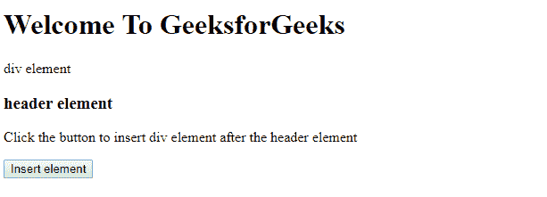
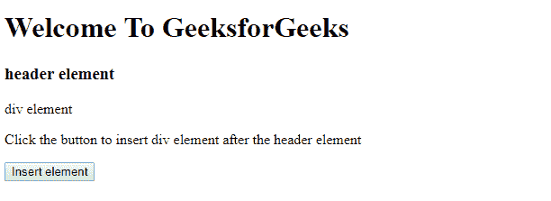

# HTML DOM `insertAdjacentElement()` 方法

> 原文：[https://www.geeksforgeeks.org/html-dom-insertadjacentelement-method/](https://www.geeksforgeeks.org/html-dom-insertadjacentelement-method/)

`insertAdjacentElement()` 方法在指定的位置插入指定的元素。
这个位置的合法值是：

*   `afterbegin`
*   `afterend`
*   `beforebegin`
*   `beforeend`

## 语法：

```html
node.insertAdjacentElement(position, element)
```

## 参数：
该方法需要 2 个参数。

*   **位置：** 相对于元素的位置。合法值是：
    1.  `afterbegin`：就在元素内部，在它的第一个子元素之前。
    2.  `afterend`：在元素本身之后。
    3.  `beforebegin`：在元素本身之前。
    4.  `beforeend`：就在元素内部，在它的最后一个子元素之后。
*   **元素：** 要插入的元素。

## 返回值：
插入的元素，如果插入失败，返回 `null`。

## 异常：
如果指定的位置没有被识别或者如果指定的元素不是有效的元素。

## 示例：

```html
<!DOCTYPE html>
<html>

<head>
    <!--script to insert specified
        element to the specified position-->

    <script>
        function insadjele() {
            var s = document.getElementById("d1");
            var h = document.getElementById("head3");

            h.insertAdjacentElement("afterend", s);
        }
    </script>
</head>

<body>
    <h1> Welcome To GeeksforGeeks</h1>

    <div id="d1">div element</div>
    <h3 id="head3">header element</h3>

    <p>Click the button to insert
        div element after the header element</p>

    <button onclick="insadjele()">Insert element</button>

</body>

</html>
```

## 输出：

**点击插入元素按钮前：**


**点击插入元素按钮后：**


## 支持的浏览器：
DOM `insertAdjacentElement()` 方法支持的浏览器如下：

*   谷歌 Chrome
*   火狐浏览器
*   歌剧
*   微软公司出品的 web 浏览器
*   旅行队