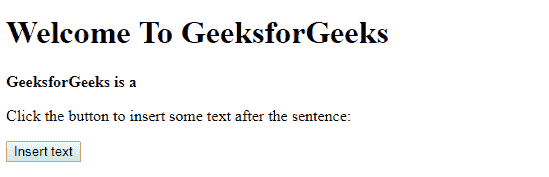

# HTML DOM `insertAdjacentText()` 方法

> 原文：[https://www.geeksforgeeks.org/html-dom-insertadjacenttext-method/](https://www.geeksforgeeks.org/html-dom-insertadjacenttext-method/)

`insertAdjacentText()` 方法在以下位置之一插入提供的文本。

*   `afterbegin`
*   `afterend`
*   `beforebegin`
*   `beforeend`

## 语法

```html
node.insertAdjacentText(position, text)
```

## 参数

该方法需要 2 个参数。

*   `position`：相对于元素的位置。合法值是：
    1.  `afterbegin`：就在元素内部，在它的第一个子元素之前。
    2.  `afterend`：在元素本身之后。
    3.  `beforebegin`：在元素本身之前。
    4.  `beforeend`：就在元素内部，在它的最后一个子元素之后。
*   `text`：要插入的文本。

## 返回值

无返回值。

## 异常

如果指定位置未被识别则抛出异常。

## 示例

```html
<!DOCTYPE html>
<html>

<head>
    <title>
        HTML | DOM insertAdjacentText() Method
    </title>
    <!--script to insert specified 
           element to specified position-->
    <script>
        function insadjtxt() {
            var h = document.getElementById("m1");
            h.insertAdjacentText("beforeend",
                " Computer Science Portal.");
        }
    </script>
</head>

<body>
    <h1> Welcome To GeeksforGeeks</h1>

<strong>
      <p id="m1">GeeksforGeeks is a </p>
    </strong>

<p>
      Click the button to insert some
      text after the sentence:
    </p>

<button onclick="insadjtxt()">
        Insert text
    </button>

</body>

</html>
```

## 输出

**点击插入文字按钮前：**


**点击插入文字按钮后：**


## 支持的浏览器

下面列出了 `DOM insertAdjacentText()` 方法支持的浏览器：

*   Google Chrome
*   Microsoft Edge
*   Firefox
*   Opera
*   Safari