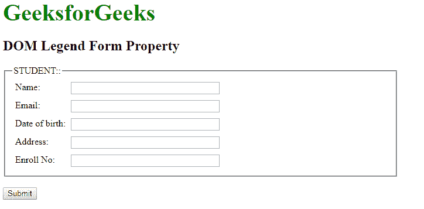
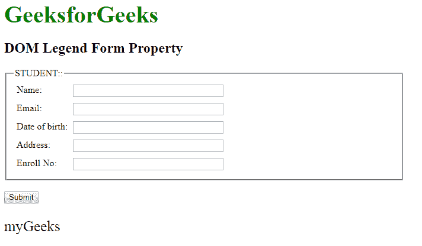

# DOM Legend form Property

> 原文: [https://www.geeksforgeeks.org/html-dom-legend-form-property/](https://www.geeksforgeeks.org/html-dom-legend-form-property/)

`DOM Legend form Property` 用于返回对包含 `<legend>` 标记的表单的引用。这是一个只读属性，成功时返回表单对象。

## 语法

```html
legendObject.form
```

## 返回值

返回对包含 `<legend>` 元素的 `<form>` 元素的引用。如果 `<legend>` 元素不在表单中，则返回 `null`。

## 示例

本示例返回一个表单属性。

### HTML 代码

```html
<!DOCTYPE html>
<html>

<head>
    <title>DOM Legend form Property</title>
    <style>
        form {
            width: 50%;
        }

        label {
            display: inline-block;
            float: left;
            clear: left;
            width: 90px;
            margin: 5px;
            text-align: left;
        }

        input[type="text"] {
            width: 250px;
            margin: 5px 0px;
        }

        .gfg {
            font-size: 40px;
            color: green;
            font-weight: bold;
        }
    </style>
</head>

<body>
    <div class="gfg">GeeksforGeeks</div>
    <h2>DOM Legend Form Property</h2>
    <form id="myGeeks">
        <fieldset>
            <!-- Assigning legend id -->
            <legend id="GFG">STUDENT::</legend>
            <label>Name:</label>
            <input type="text">
            <br>
            <label>Email:</label>
            <input type="text">
            <br>
            <label>Date of birth:</label>
            <input type="text">
            <br>
            <label>Address:</label>
            <input type="text">
            <br>
            <label>Enroll No:</label>
            <input type="text">
        </fieldset>
    </form>
    <br>
    <button onclick="myGeeks()">Submit</button>
    <p id="sudo" style="font-size:25px;"></p>

    <script>
        function myGeeks() {
            // Accessing legend tag
            var g = document.getElementById("GFG").form.id;
            document.getElementById("sudo").innerHTML = g;
        }
    </script>
</body>

</html>
```

## 输出

### 点击按钮前



### 点击按钮后



## 支持的浏览器

*   Google Chrome
*   Mozilla Firefox
*   Microsoft Edge
*   Opera
*   Safari