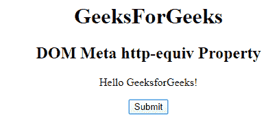
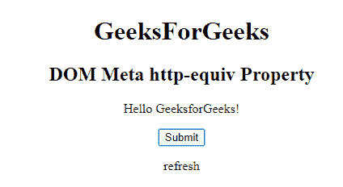

# HTML DOM Meta httpEquiv 属性

> 原文：[https://www.geeksforgeeks.org/html-dom-meta-httpequiv-property/](https://www.geeksforgeeks.org/html-dom-meta-httpequiv-property/)

**HTML DOM Meta httpEquiv 属性**用于为 `content` 属性中的信息设置或返回一个 HTTP 头。该属性用于提供标题信息或 `content` 属性的值。它可以用来模拟一个 HTTP 头响应。

## 语法

### 返回属性

```html
metaObject.httpEquiv
```

### 用于设置 httpEquiv 属性

```html
metaObject.httpEquiv = "HTTP-he"
```

## 属性值

*   **content-type**：指定文档内容的字符集。
*   **default-style**：指定了要使用的首选样式表。
*   **refresh**：定义文档自身刷新的时间间隔。

## 示例

```html
<!DOCTYPE html>
<html>

<head>
  <meta http-equiv="refresh" content="30">
</head>

<body>
  <center>
    <h1>GeeksForGeeks</h1>
    <h2>DOM Meta http-equiv Property</h2>
    <p>Hello GeeksforGeeks!</p>

    <button onclick="myGeeks()">
      Submit
    </button>

    <p id="sudo"></p>

    <script>
      function myGeeks() {
        var x = document.getElementsByTagName("META")[0].httpEquiv;
        document.getElementById("sudo").innerHTML = x;
      }
    </script>
  </center>
</body>

</html>
```

## 输出

**点击按钮前：**


**点击按钮后：**


## 支持的浏览器

DOM Meta httpEquiv 属性支持的浏览器如下：

*   谷歌 Chrome
*   微软公司出品的 web 浏览器
*   火狐浏览器
*   苹果 Safari
*   歌剧