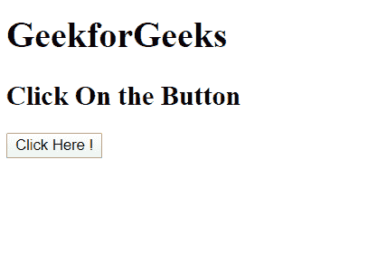
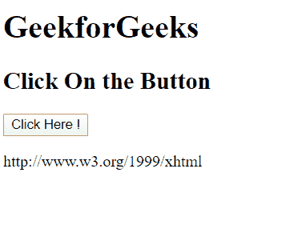

# HTML DOM `namespaceURI` 属性

> 原文: [https://www.geeksforgeeks.org/html-dom-namespaceuri-property/](https://www.geeksforgeeks.org/html-dom-namespaceuri-property/)

`namespaceURI` DOM 属性返回指定节点命名空间的 URI。此属性是只读的。

**注意:** Internet Explorer 8 及更早版本不支持此属性。

**返回值:** 表示节点命名空间 URI 的字符串，如果节点不在命名空间中，则为空。

**语法:**

```html
node.namespaceURI
```

**例:**

```html
<!DOCTYPE html>
<html>

<body>
    <h1>GeekforGeeks</h1>
    <h2>Click On the Button</h2>

    <button onclick="show()">
        Click Here !
    </button>

    <p id="uri"></p>

    <script>
        function show() {
            var x = document.documentElement.namespaceURI;
            document.getElementById("uri").innerHTML = x;
        }
    </script>

</body>

</html>
```

**输出:**

**点击按钮前:**



**点击按钮后:**



**支持的浏览器:** 下面列出了 `namespaceURI` 属性支持的浏览器:

*   谷歌 Chrome
*   Internet Explorer 9.0
*   火狐浏览器
*   歌剧
*   旅行队