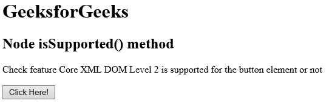
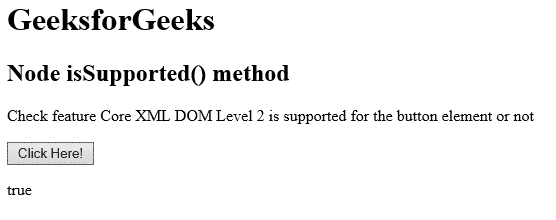

# HTML DOM 节点 isSupported() 方法

> 原文：[https://www.geeksforgeeks.org/html-dom-node-issupported-method/](https://www.geeksforgeeks.org/html-dom-node-issupported-method/)

HTML DOM 中的 `isSupported()` 方法用于检查指定的特征是否被指定的节点支持。许多浏览器不支持此方法。如果支持该功能，则返回 `true`，否则返回 `false`。

## 语法

```html
node.isSupported(feature, version)
```

## 使用的参数

*   `feature`：为必输参数，用于定义特征，检查是否支持。
*   `version`：它是一个可选参数，用于定义要检查是否支持的功能版本。

下面的程序说明了 HTML 文档中的 `Node.isSupported()` 方法：

## 示例

本示例检查 `<button>` 元素是否支持 Core 2.0 版功能。

```html
<!DOCTYPE html>
<html>

<head> 
    <title> 
        HTML DOM Node isSupported() method
    </title> 
</head>

<body>
    <h1>GeeksforGeeks</h1>

<h2>Node isSupported() method</h2>

<p>
        Check feature Core XML DOM Level 2 is
        supported for the button element or not
    </p>

<button onclick = "myGeeks()">
        Click Here!
    </button>

<p id = "GFG"></p>

<script>
      function myGeeks() {
        var item = document.getElementsByTagName("BUTTON")[0];
        var x = item.isSupported("Core", "2.0");
        document.getElementById("GFG").innerHTML = x;
      }
  </script>
</body>

</html>   
```

## 输出

**之前点击按钮：**


**之后点击按钮：**


## 支持的浏览器

`Node.isSupported()` 方法支持的浏览器如下：

*   Internet Explorer 9.0
*   Safari