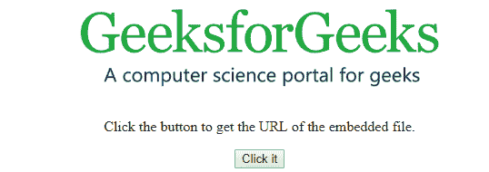
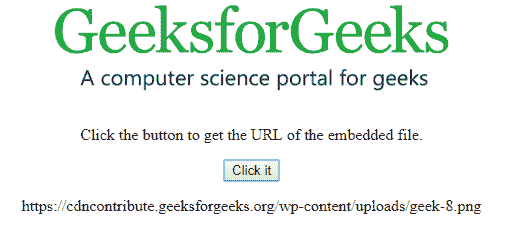
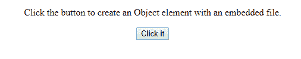
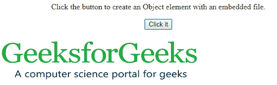

# HTML DOM Object对象

> 原文：`https://www.geeksforgeeks.org/html-dom-object-object/`

`object`对象只代表 HTML [`<object>`](https://www.geeksforgeeks.org/html-object-tag/) 元素。我们可以使用 `getElementById()` 访问任何 `<object>` 元素；也可以使用 `createElement()` 创建对象元素。

**语法：**

### 用于访问 `object` 元素

```html
document.getElementById("id"); 
```

### 用于创建 `object` 元素

```html
document.createElement("object");
```

**属性值：**

| 属性 | 说明 |
| :--- | :--- |
| align | 设置或返回对象的对齐方式。 |
| archive | 用于设置或返回实现中的存档功能。 |
| border | 设置或返回对象的边框。 |
| codebase | 设置或返回组件的 URL。 |
| data | 设置或返回资源的 URL。 |
| form | 返回对父表单的引用。 |
| height | 用于设置或返回对象的高度。 |
| name | 设置或返回对象的名称。 |
| standby | 用于设置或返回对象加载时显示的消息。 |
| type | 设置或返回下载数据的内容类型。 |
| usemap | 设置或返回客户端图像映射的 URL。 |
| width | 设置或返回对象的宽度。 |

**示例-1：** 访问对象元素并返回资源的 URL

### HTML

```html
<!DOCTYPE html>
<html>

<body>
    <center>
        <object id="myobject"
                width="400"
                data="https://media.geeksforgeeks.org/wp-content/uploads/geek-8.png">
        </object>

        <p>Click the button to get the URL of the embedded file.</p>

        <button onclick="Geeks()">
            Click it
        </button>

        <p id="gfg"></p>

    </center>
    <script>
        function Geeks() {
            // Accessing Object element.
            var x = document.getElementById("myobject").data;
            document.getElementById("gfg").innerHTML = x;
        }
    </script>

</body>

</html>
```

**输出：**

*   **点击按钮前：**



*   **点击按钮后：**



**示例-2：** 使用 `document.createElement()` 创建对象元素。

### HTML

```html
<!DOCTYPE html>
<html>

<body>
    <center>

        <p>Click the button to create an Object element with an embedded file.</p>

        <button onclick="Geeks()">
            Click it
        </button>

        <p id="gfg"></p>

        <script>
            function Geeks() {
                // Creating object element.
                var x = document.createElement("OBJECT");
                // Set data of the OBJECT.
                x.setAttribute("data", "https://media.geeksforgeeks.org/wp-content/uploads/geek-8.png");
                x.setAttribute("width", "400");
                x.setAttribute("height", "100");
                document.body.appendChild(x);
            }
        </script>
    </center>
</body>

</html>
```

**输出：**

*   **点击按钮前：**



*   **点击按钮后：**



**支持的浏览器：**

*   Google Chrome
*   Mozilla Firefox
*   Microsoft Edge
*   Safari
*   Opera