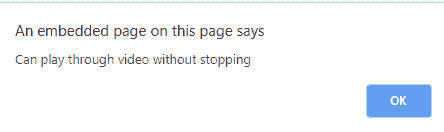

# HTML DOM oncanplaythrough 事件

> 原文：[https://www.geeksforgeeks.org/html-dom-oncanplaythrough-event/](https://www.geeksforgeeks.org/html-dom-oncanplaythrough-event/)

**HTML DOM `oncanplaythrough` 事件**发生在指定媒体被缓冲并且浏览器估计它可以播放而不必停止的时候。
音频/视频加载过程中事件发生的顺序：

*   `onloadstart`
*   `ondurationchange`
*   `onloadedmetadata`
*   `onloadeddata`
*   `onprogress`
*   `oncanplay`
*   `oncanplaythrough`

**支持的标签**

*   `<audio>`
*   `<video>`

**语法：**

**在 HTML 中：**

```html
<element oncanplaythrough="myScript">
```

**在 JavaScript 中：**

```javascript
object.oncanplaythrough = function(){myScript};
```

**在 JavaScript 中，使用 `addEventListener()` 方法：**

```javascript
object.addEventListener("canplaythrough", myScript);
```

## 示例：使用 HTML

```html
<!DOCTYPE html>
<html>

<body>
    <center>
        <h1 style="color:green">
          GeeksforGeeks
      </h1>
        <h2>HTML DOM oncanplaythrough event</h2>
        <video controls oncanplaythrough="myFunction()">
            <source src="Geekfun.mp4" type="video/mp4">
        </video>

        <script>
            function myFunction() {
                alert("Can play through video without stopping");
            }
        </script>
    </center>
</body>

</html>
```

**输出：**



## 示例：使用 JavaScript

```html
<!DOCTYPE html>
<html>

<body>
    <center>
        <h1 style="color:green">
          GeeksforGeeks
      </h1>
        <h2>HTML DOM oncanplaythrough event</h2>
        <video controls id="myVideo">
            <source src="Geekfun.mp4" type="video/mp4">
        </video>

        <script>
            document.getElementById("myVideo").oncanplaythrough = function() {
                myFunction()
            };

            function myFunction() {
                alert("Can play through video without stopping");
            }
        </script>
    </center>
</body>

</html>
```

**输出：**


## 示例：使用 `addEventListener()` 方法

```html
<!DOCTYPE html>
<html>

<body>
    <center>
        <h1 style="color:green">
          GeeksforGeeks
      </h1>
        <h2>HTML DOM oncanplaythrough event</h2>
        <video controls id="myVideo">
            <source src="Geekfun.mp4" type="video/mp4">
        </video>

        <script>
            document.getElementById("myVideo").addEventListener("canplaythrough", myFunction);

            function myFunction() {
                alert("Can start playing video");
            }
        </script>
    </center>
</body>

</html>
```

**输出：**


**支持的浏览器：** DOM `oncanplaythrough` 事件支持的浏览器如下：

*   Google Chrome
*   Microsoft Edge
*   Firefox
*   Safari
*   Opera